# Mini Meteorological Statio for kidsIOT

## 1. Code

[DOWNLOAD](../Code.zip)

Download and unzip these files. Here all codes are in folder **2.Code_kidsIOT**.

For convenience, we move the codes into: **D:\Code\2.Code_kidsIOT**. You can also choose to move it into any disks at will. 

---

## 2. Development Environment Configuration

2.1 KidsBlock Download

1. [KidsBlock Download](https://wiki.kidsbits.cc/projects/KidsBlock/en/latest/download/)
2. Installation
	- [Windows System](https://wiki.kidsbits.cc/projects/KidsBlock/en/latest/Windows/)
	- [MacOS System](https://wiki.kidsbits.cc/projects/KidsBlock/en/latest/MacOS/)
3. [Driver Installation](https://wiki.kidsbits.cc/projects/KidsBlock/en/latest/driver/)

---

2.2 KidsBlock Tutorial

1. Make sure the board is connected to computer. Open KidsBlock and choose a device.

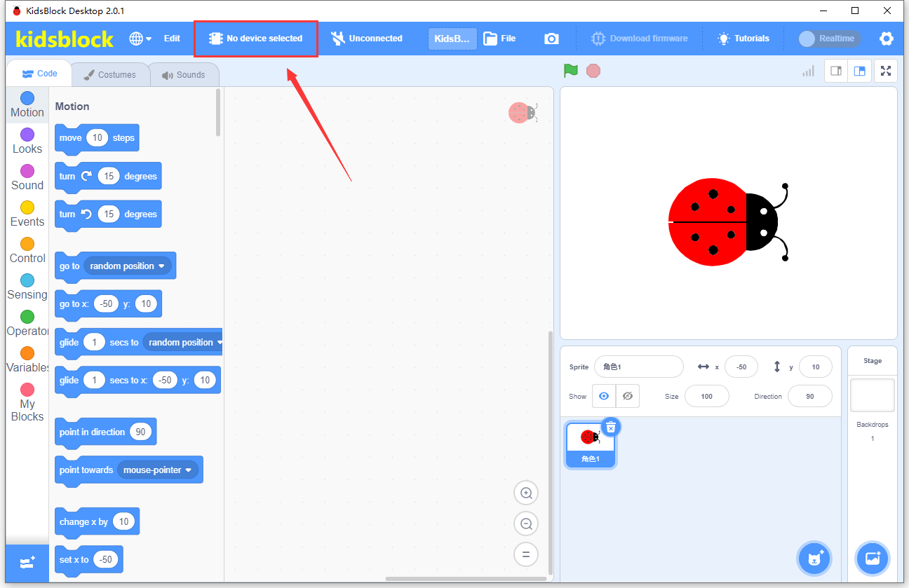

Choose **kidsIOT**.

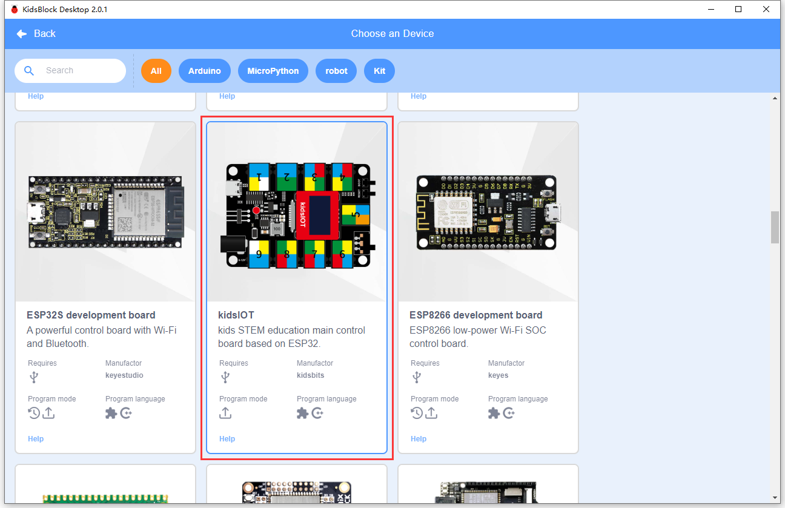

Click **Connect**.

**Go to Editor** .

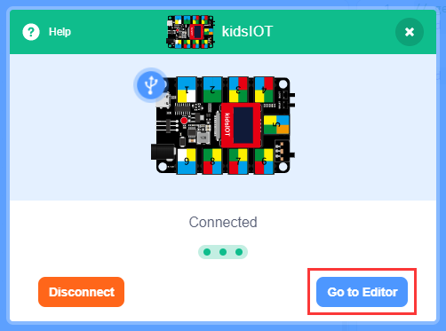

2. Build code blocks and upload.

**Method ①**: Directly drag blocks to the editing area.

After building your blocks, save it to your computer: **File --> Save to your computer**

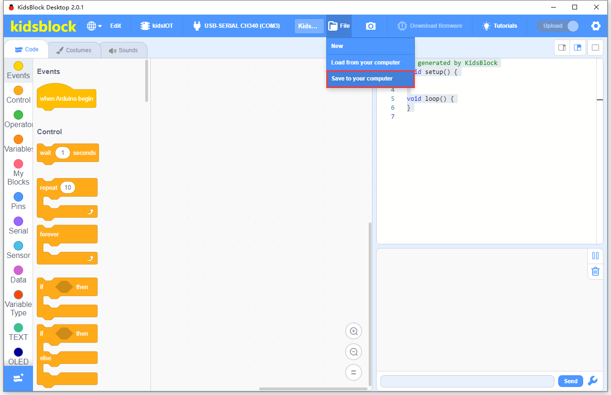

Click  to upload the code.

**Method ②**: Load code from your computer.

Download code in **1. Code** to your computer. For convenience, here we save it to D:\Code\2.Code_kidsIOT.

**File --> Load from your computer** and choose code to open.

After loading code, connect to the corresponding port.

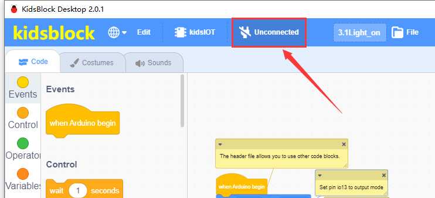

After that, click  to upload code.

**Main Interface**

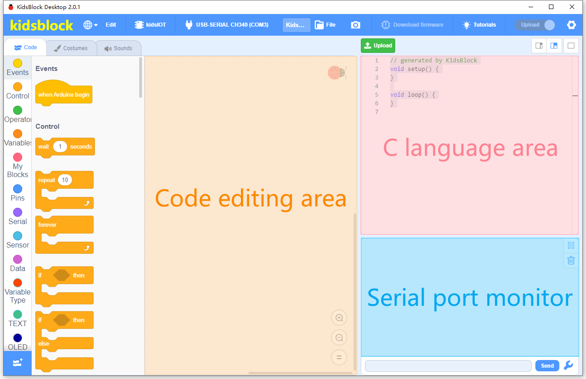

---

## 3. Modules

Please move the codes to a convenient path as your needs, for instance, path: **D:\Code\2.Code_kidsIOT**.

KidsIOT Ports View

During experiments, modules can only be connected to ports in the same color.

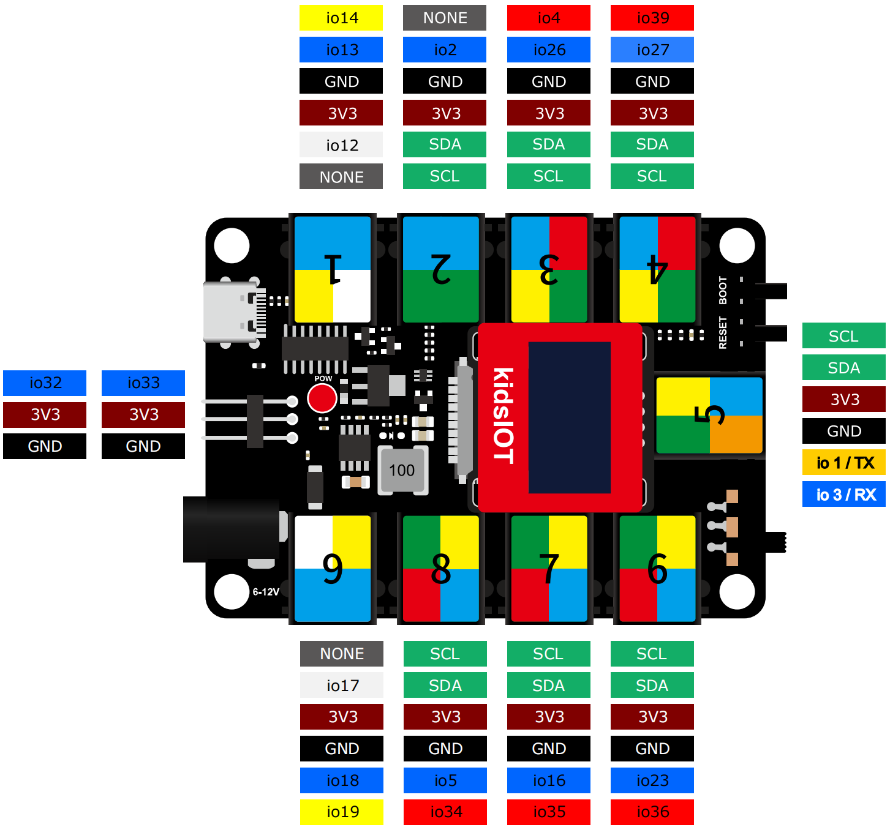

3.1 White LED Module

**LED (Light-Emitting Diode)**

LED is a commonly used light emitting device that converts electrical energy into light energy. Usually, it is used as an indicator in circuits and instruments, or as part of texts or numeric display.

It generally includes gallium(Ga), arsenic(As), phosphorus(P), nitrogen(N) and so on. 

|     LED components      | Emitting light colors |
| :---------------------: | :-------------------: |
| gallium arsenide diode  |          red          |
| gallium phosphide diode |         green         |
|  silicon carbide diode  |        yellow         |
|  gallium nitride diode  |         blue          |

Parameters

Operating voltage: DC 3.3 ~ 5 V

Operating current: 1.5 mA (Peak: 2.3mA)

Maximum power: 0.07 W

Control signal: digital signal

Dimensions: 24 x 48 x 18 mm (without housing)

Positioning holes: diameter of 4.8 mm

Interface: telephone socket

Principle

Modules with blue housing are digital ones, so we should connect to digital io pins of the mainboard (ports with blue).

In this experiment, we connect the white LED module to port 1. According to the board ports view, the digital io pin at port 1 is io13.

When we set the pin to high(1), the LED lights up in white; if we set to low(0), it will be off.

Wiring Diagram

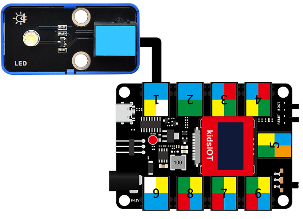

Test Code

Open KidsBlock and connect the board to your computer. Click **File --> Load from your computer**.

Choose D:\Code\2.Code_kidsIOT to open **3.1Light_on.sb3** file.

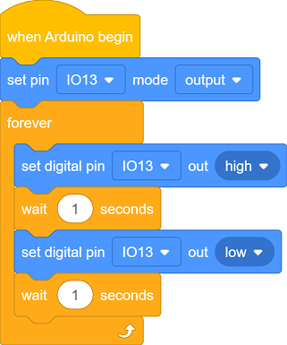

Click  to connect to port and then .

Explanations

**Code Blocks**

|            Blocks             |          Code block           |
| :---------------------------: | :---------------------------: |
|    |      |
|              |  |
|              |    |
|  |  |
|  |        |

**Conceive:**

1. **Initialization**

   Set pins and modes.

   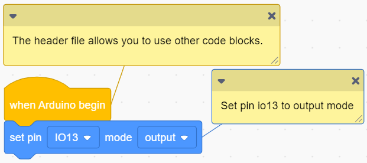

    

   **Build blocks:**

   ① Add  and  .

   ② Choose pin 13.

   

   ③ set mode to output.

   pin mode can be one of the followings:

   - input
   - output
   - input-pullup

   
   
   Q ：Why "output"?

   A ：The code is written for the mainboard. For the board, pin io13 is outputting power levels (high or low) to the connected module.

   

2. **Main Code**

   Loop: LED turns on for 1s and off for 1s.

   

    

   **Build blocks:**

   ① . Code blocks in it will run in a loop.

   ② Add  into "forever". 

   This block set output power level:

   - high
   - low
   
   Set pin 13 to output high.

   ③ Add a delay .

   

   Q ：Why delay?

   A ：If you output a high level to LED, it will be always on. Yet, we add a delay of 1s, so it lights up for only 1s. Delay time is the ON/OFF time of LED.

   

   Set pin io13 to output high for 1s:

   

   ④ Duplicate the blocks.

   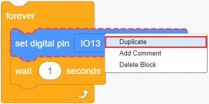

   As follows:

   

   Modify to low. Pin io13 outputs low for 1s.

   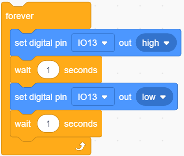

   The LED will circularly be on for 1s and off for 1s.

Test Result

After uploading code, the LED module will flash with an interval of 1s (on for 1s and off for 1s).

---

3.2 Hall Magnetic Sensor

This Hall sensor module is mainly composed of A3144 linear Hall components. 

Based on Hall Effect, its magnetic sensitive circuit adopts semiconductor integration technology, which is a magnetic sensing circuit composed of a voltage regulator, a Hall voltage generator, a differential amplifier, a Schmidt trigger temperature compensation circuit and an open-collector output stage. 

Its input is the magnetic induction intensity and its output is a digital voltage signal.

Parameters

Voltage: DC 3.3 ~ 5V 

Current: 10 mA

Maximum power: 0.05 W

Operating temperature: -10°C ~ +50°C

Dimensions: 32 x 24 x 18 mm (without housing)

Positioning hole: diameter of 4.8mm

Interface: Telephone socket

Principle

This Hall sensor is able to distinguish magnetic field north and south. The front of the magnetic induction element (with numbers) senses the South Pole, while its back detects the North Pole.

Modules with blue housing are digital ones, so we should connect to digital io pins of the mainboard (ports with blue).

In this experiment, we connect the Hall sensor module to port 2. According to the board ports view, the digital io pin at port 2 is io2.

When a magnetic field is detected, Hall sensor outputs low; When no magnetic field is detected, the sensor outputs high.

Wiring Diagram

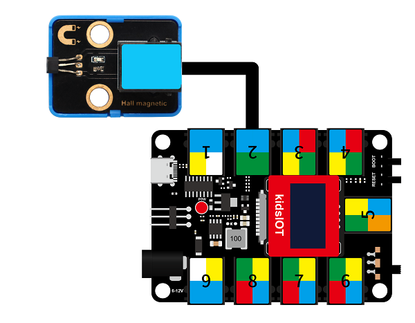

Test Code

Open KidsBlock and connect the board to your computer. Click **File --> Load from your computer**.

Choose D:\Code\2.Code_kidsIOT to open **3.2Hall sensor.sb3** file.

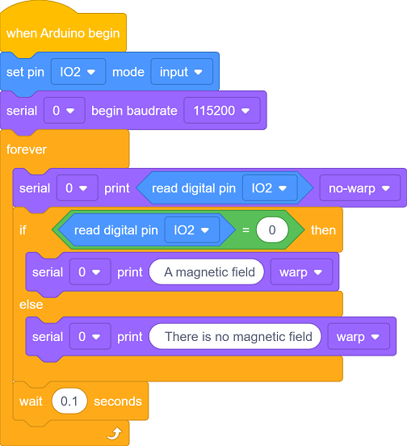

Click to connect to port and then .

Explanations

**Code Blocks**

|              Blocks               |              Code block               |
| :-------------------------------: | :-----------------------------------: |
|        |              |
|                  |          |
|                  |  |
|        |  |
|        |  |
|  |                      |
|      |          |
|      |            |
|      |                |

**Conceive:**

1. **Initialization**

   Set pins and modes, initialize serial port.

   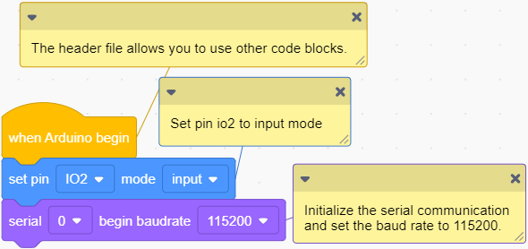

    

   **Build blocks:**

      ① Drag blocks and build as follows:

   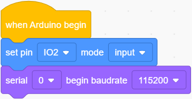

   

       : initialize serial port. Set baud rate (9600 by default). This block is indeed if you need to display messages on serial monitor. Otherwise, it fails to output.

   

   Connect Hall sensor to pin io2 on the board, and set it to input.

   

   Q ：Why "input"?

   A ：The code is written for the mainboard. For the Hall sensor, it is outputting power levels to the pin io2 on the board, so the board is receiving(inputting) levels.

   

2. **Main Code**

   Loop: If a magnetic field is detected, serial monitor prints *A magnetic field*. If not, it displays *There is no magnetic field*.

   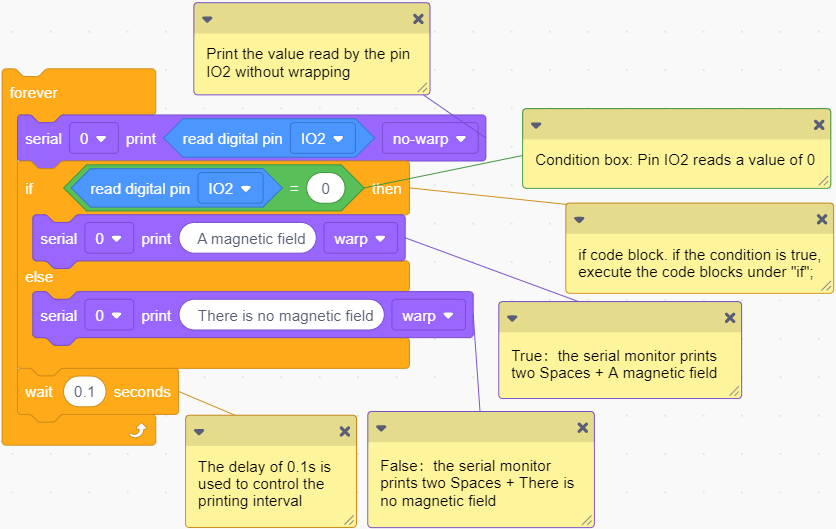

    

   **Build blocks:**

   ① Drag blocks and build as follows:

   

   

    reads digital power levels and outputs 1(high) or 0(low).

    will prints the messages in it on the serial monitor. Or you can put some variables in the printing box to display their values. Three modes are available: wrap, no wrap, HEX.

   

   Set pin to IO2 and print the value without wrapping.

   

   

      Q ：Why no-wrap?

      If we set to wrap, the message will have a line break after the power level value being output.

      Wrap: 

      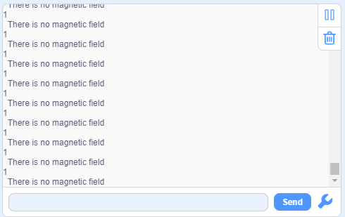

      No-wrap:

     

      A ：No-wrap is more convenient for us to check the results.

   

   ② Drag blocks and build as follows:

   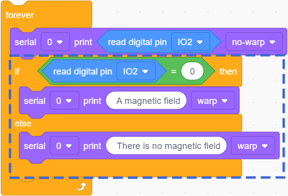

   

   : check whether the two values equal each other. If yes, outputs true.

   : if else. It determines the condition is true or false. 

   True: execute codes in "if":

   

   False: execute codes in "else":

   

   

    determines whether the value read by pin io2 equals 0.

   Put it in "if else" block to set it to the condition.

   value of pin io2 = 0: the condition is true, execute codes in "if", and print two Space + *A magnetic field* on the serial monitor.

   value of pin io2 ≠ 0: the condition is false, execute codes in "else", and print two Space + *There is no magnetic field* .

   

      Q ：Why Space?

   The value will be too close to the contents, which is not convenient for us to check the outputs.

   Without space:

      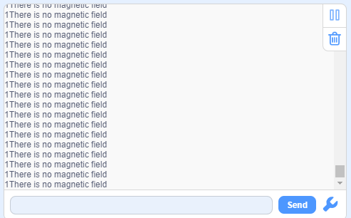

      With space:

      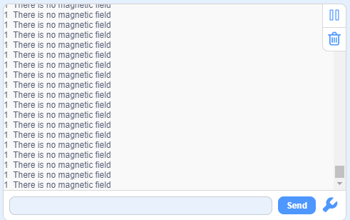

     A ：We add a space to separate the value and contents.

   

   ③ Add a delay  and set time to 0.1s.

   

   Q ：Why delay?

   If we do not add a delay, the printing command will always run, so then the serial monitor refreshes the results very fast. A delay of 0.1s will limit the printing speed. Serial monitor refreshes outputs every 0.1s.

   A ：Limit the printing speed.

   

Test Result

Set baud rate before uploading code to avoid garbled words.

Click  to set Buadrate to 115200.

After uploading the code, when the **South Pole** of the magnet approaches to the front of the magnetic induction element, the red LED lights up and Shell prints *0  A magnetic field*; 

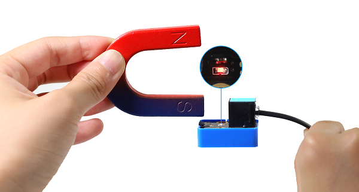

When the **South Pole** of the magnet approaches to its back or is away from the sensor, the red LED goes off, and Shell prints *1  There is no magnetic field* .

Put the **North Pole** of the magnet to the back of the element, the red LED lights up and Shell prints *0  A magnetic field*; 

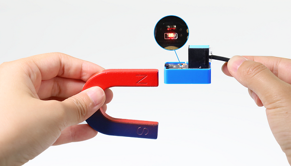

When the **North Pole** of the magnet approaches to the front of the sensor or is away from it, the red LED goes off, and Shell prints *1  There is no magnetic field*.

---

3.3 Passive Buzzer

Buzzer is an integrated structure of electronic sound device, which is powered by DC voltage. In application, it is widely used in computers, printers, copiers, alarms, electronic toys, automotive electronic equipment, telephones and timers. 

Buzzers can be divided into active ones(built-in drive circuits) and passive ones(external drive) according to that whether they includes an excitation source.

Active buzzers contain oscillation source inside, which can sound at a fixed frequency once be triggered. They are convenient in program control and features high sound pressure.

Passive ones, however, do not include oscillating sources. If we directly power a passive buzzer via DC voltage, it will emit no sound. According to needs, we generally drive through square waves, whose frequency determines the sound tones.

**To sum up, The active buzzer contains a vibration source, and its sound frequency is fixed. Yet there is no vibration source inside the passive one, so it must be driven by square waves whose frequency can be changed to control sounds.**

Parameters

Operating voltage: DC 3.3 ~ 5V 

Operating temperature: -10°C ~ +50°C

Control signal: Digital signal

Dimensions: 48 x 24 x 18 mm (without housing)

Positioning hole: diameter of 4.8mm

Interface: Telephone socket

Principle

Music is an invisible art. It is a language that narrates emotions and thoughts. 

The foundation of music, as we all know, is note. We can compose a variety of melodies and rhythms with different notes. Of all the notes, the most basic are seven:

We can compose a variety of melodies and rhythms with these notes.

Passive buzzer module must be drive by square waves to emit sound. We can change the duty cycle of PWM to control square waves.

- The greater the duty cycle is, the lauder the sound will be.

And the tones vary from different frequency of PWM.

- The higher the frequency is, the higher the tone will be.

**What is PWM?**

PWM (Pulse width modulation) simulates the change of analog signal through digital signal.

Pulse width is the high level in a complete square wave cycle. So, pulse width modulation is to adjust the high level(of course, in other words, low level is also adjusted).

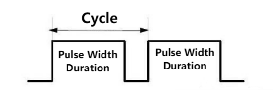

- **PWM frequency**: the number of times the signal going from high level to low level and back to high level in 1 second (one cycle), that is, how many cycles there are in a second.

	**Unit**: Hz

	**Expression**: 50Hz 100Hz

- **PWM cycle**

	$ T= \frac {1}{f}$      $ cycle = \frac {1}{frequency}$

	If the frequency is 50Hz, the cycle will be 20ms, i.e., there are 50 PWM cycles in one second.

- **PWM duty cycle**: the ratio of high level time to the whole cycle time.

	- Unit: %(1% ~ 100%)
	- Cycle: The time of a pulse signal. The number of cycles in 1s equals the frequency.
	- Pulse width time: high level time.

The relationship between duty cycle and LED brightness

The longer the high level time is, the greater the duty cycle will be, and the brighter the LED will be.

**The PWM frequency corresponding to notes**:

Modules with blue housing are digital ones, so we should connect to digital io pins of the mainboard (ports with blue).

In this experiment, we connect the passive buzzer to port 3. According to the board ports view, the digital io pin at port 3 is io26.

Wiring Diagram

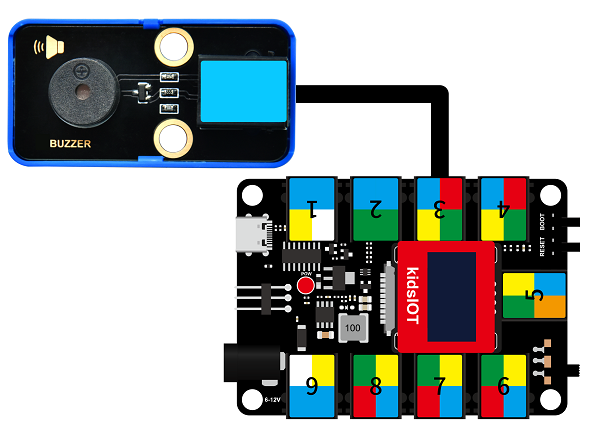

Test Code

Open KidsBlock and connect the board to your computer. Click **File --> Load from your computer**.

Choose D:\Code\2.Code_kidsIOT to open **3.3Passive buzzer.sb3** file.

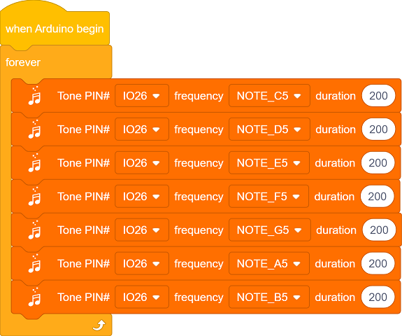

Click to connect to port and then .

Explanations

**Code Blocks**

|            Blocks             |              Code block               |
| :---------------------------: | :-----------------------------------: |
|    |              |
|    |  |
|  |          |
|  |                |

**Conceive:**

Add library first. Click  and find **esp32 Passive buzzer** to add in extension.

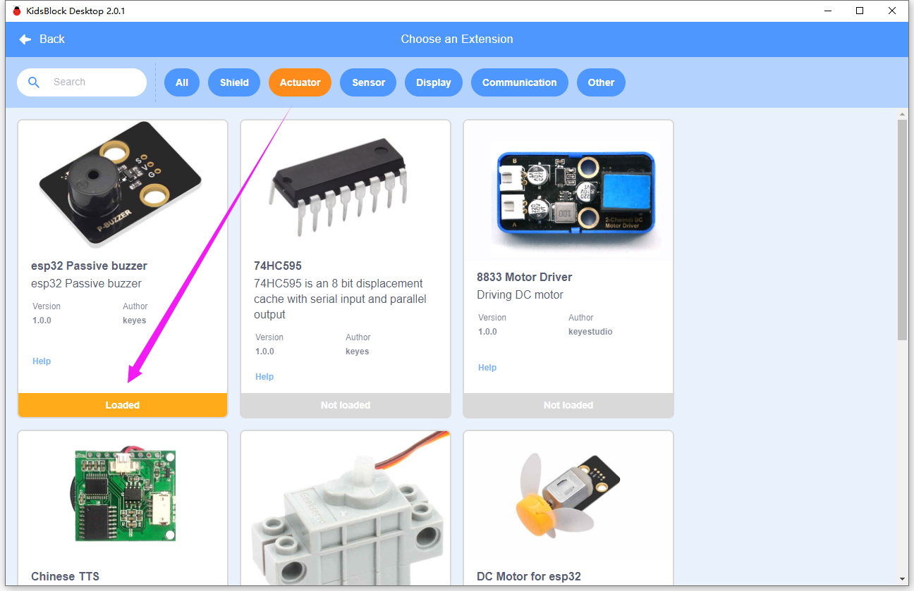

Click **Back**

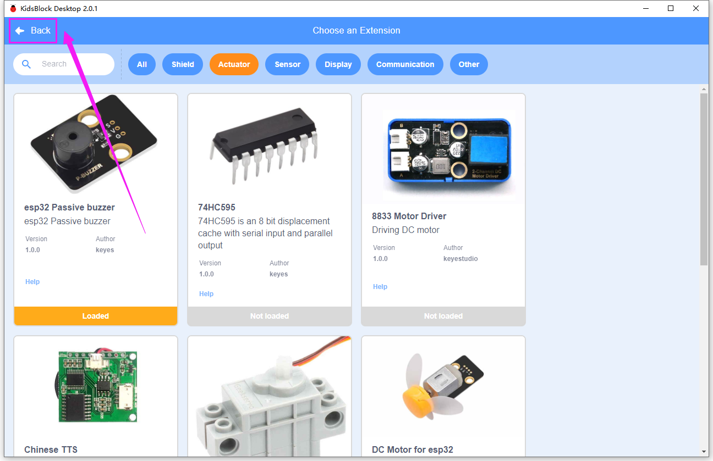

Successfully load.

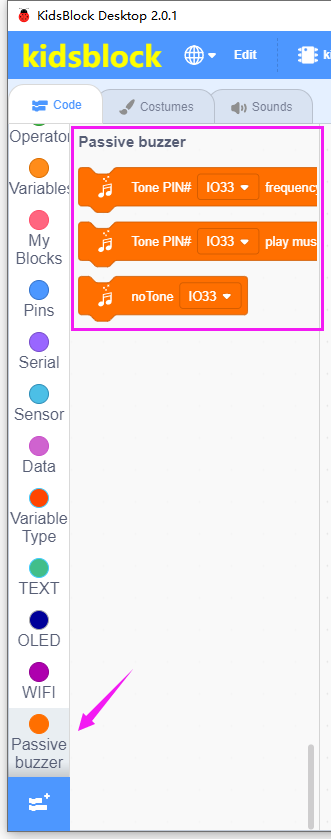

1. **Main Code**

   Loop: play tones of C, D, E, F, G, A, B, each tone plays 200ms.

   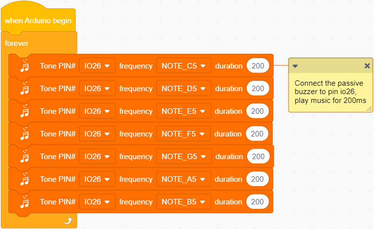

    

   **Build blocks:**

   ① Build blocks as follows:

   

   

    sets the passive buzzer to play tones. We can set its frequency.

   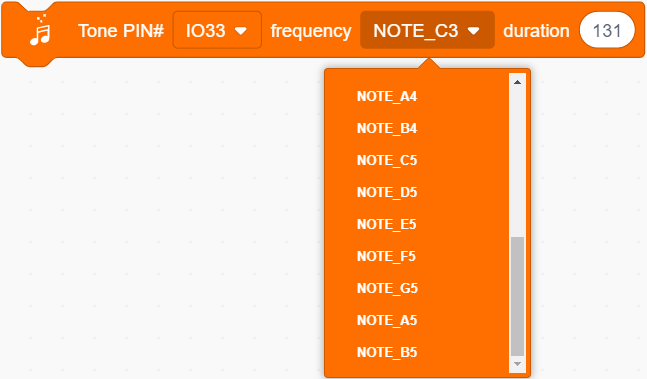
   
   You can set beats by modifying the duration.
   
   
   
   Q ：What is beats?
   
   A ：A beat is the basic unit of time in music. you can regard it as the duration.
   
   
   
   
   
   Set pin to IO26 and frequency to NOTE_C5, set duration to 200ms.
   
   
   
   ② Duplicate the blocks.
   
   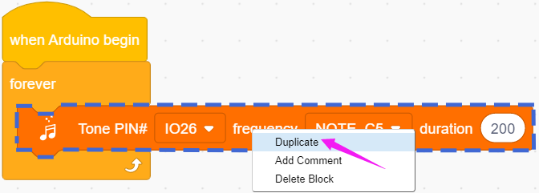
   
   As follows:
   
   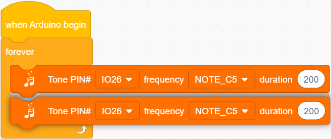
   
   Duplicate six times, as follows:
   
   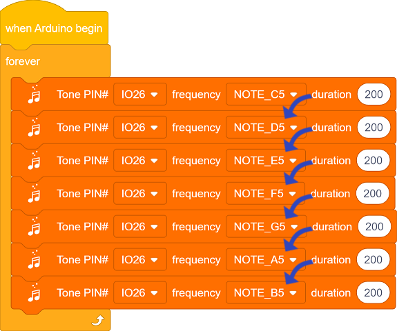

Test Result

After uploading the code, the buzzer will circularly play tones(C, D ,E, F, G, A, B).

Extension

Congratulations! You have played these basic notes successfully! Now let's try to compose a beautiful music and play with this passive buzzer!

Open **3.3Music.sb3** file.

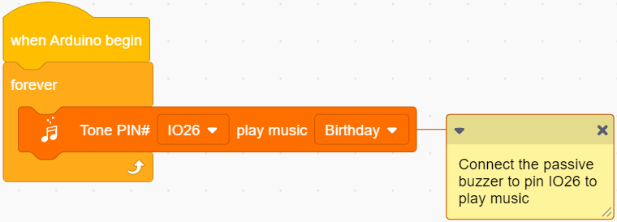

Choose a music you like.

Click to connect to port and then .

Upload! And you will hear the music!

---

3.4 XHT11 Temperature and Humidity Sensor

XHT11 sensor is a low-cost and entry-level temperature and humidity sensor, which consists of a resistive humidity sensor and an NTC temperature sensor. It is designed 4-pin single-row pin and adopts single-wire serial interface, so we just add the appropriate pull-up resistance to read values. Moreover, its signal transmission distance can reach more than 20 meters.

Parameters

Operating voltage ：DC 3.3 ~ 5V 

Operating current: 2.1 mA

Maximum power: 0.015 W

Humidity detection range: 5 ~ 95%RH (accuracy of ±5%RH under 25°C)

Temperature detection range: -25°C ~ +60°C

Operating temperature: -10°C ~ +50°C

Input signal: Digital signal

Dimensions: 48 x 24 x 18 mm (without housing)

Positioning hole: diameter of 4.8mm

Interface: Telephone socket

Principle

Modules with blue housing are digital ones, so we should connect to digital io pins of the mainboard (ports with blue).

In this experiment, we connect the passive buzzer to port 4. According to the board ports view, the digital io pin at port 4is io27.

Wiring Diagram

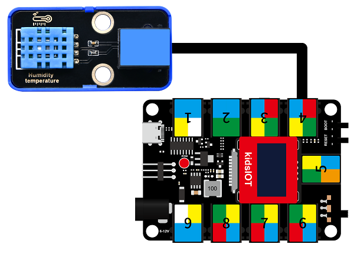

Test Code

Open KidsBlock and connect the board to your computer. Click **File --> Load from your computer**.

Choose D:\Code\2.Code_kidsIOT to open **3.4Humiture.sb3** file.

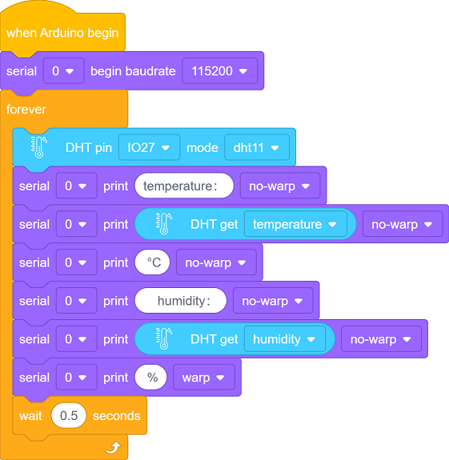

Click to connect to port and then .

Explanations

**Code Blocks**

|            Blocks             |              Code block               |
| :---------------------------: | :-----------------------------------: |
|    |              |
|    |  |
|    |  |
|          |          |
|          |              |
|  |          |
|  |                |

**Conceive:**

Add library first, Click  to load **DHT sensor for ESP32** .

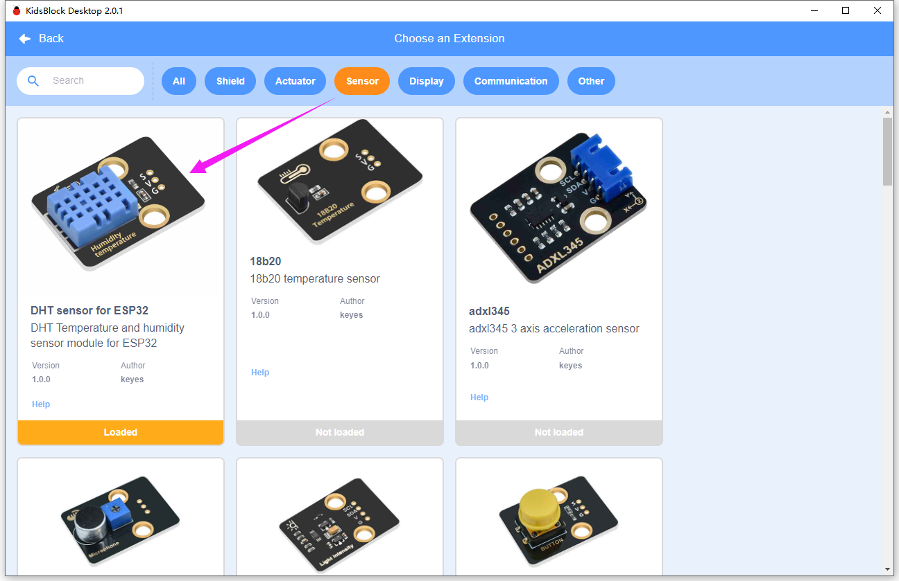

1. **Initialization**

   Initialize serial port.

   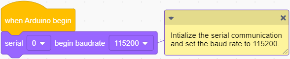

2. **Main Code**

   Loop: read and print the temperature and humidity value every 0.5s.

   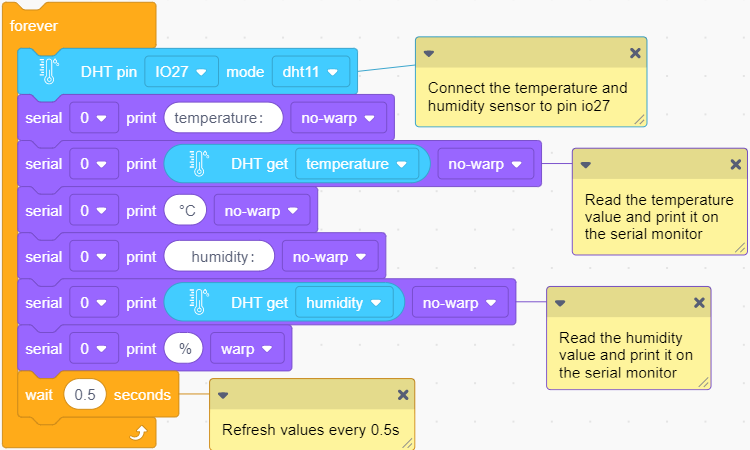

    

   **Build blocks:**

   ① Drag blocks and build as follows:

   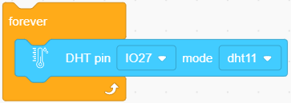

   

    set the sensor pin.

   

   ② Drag blocks and build as follows:

   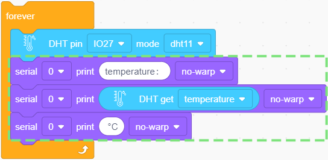

   

    read the temperature or the humidity value.

   
   
   Herein, print "temperature:" + measured actual temperature value + " °C" without wrapping. There is a space before °C, which is convenience for us to check results.
   
   ③ Drag blocks and build as follows:
   
   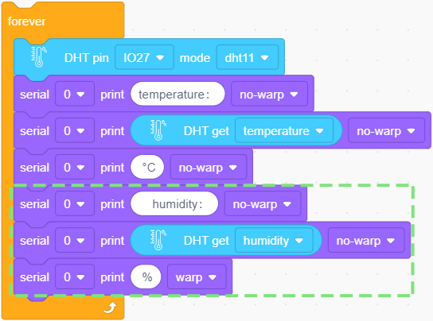
   
   This code prints the actual humidity value in the unit of " %" without wrapping. There is also a space before %.
   
   ④ Add a delay  and set it to 0.5, so the results will be refreshed every 0.5s.

Test Result

Set baud rate before uploading code to avoid garbled words.

Click  to Buadrate to 115200 .

After uploading the code, the serial monitor prints the actual temperature and humidity value every 0.5s.

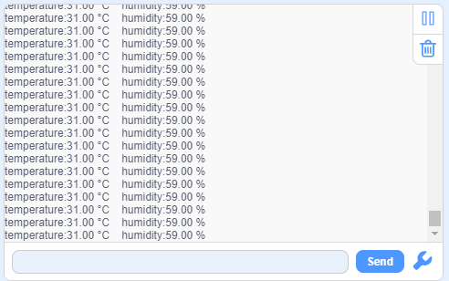

Blow to the XHT11 sensor and you will see both temperature and humidity values rise.

---

3.5 Steam Sensor

Unlike the previous modules, the steam sensor is an analog module rather than a digital one.

What is the difference? For digital modules, they only output high(3.3V) or low(0V); while analog ones are able to output or input intermediate voltage values through ADC analog ports on the board.

Parameters

Operating voltage: DC 3.3 ~ 5V 

Operating current: 1.5 mA

Maximum power: 0.075 W

Operating temperature: -10°C ~ +50°C

Dimensions: 48 x 24 x 18 mm (without housing)

Positioning hole: diameter of 4.8mm

Interface: Telephone socket

Principle

The steam sensor measures the amount of water through its exposed lines. The water will connect these lines. The more amount of water is, the wider the conductive area will be connected, and the higher the output voltage will be.

With the change of amount of water, the voltage (0 ~ 3.3V) detected by the analog port will change accordingly. This change is continuous, which means it can be any value within 0 ~ 3.3V.

The board can only process digital signals, so we need to convert analog signals in to digital ones. Thus, an ADC(Analog to Digital Converter) acquisition is required.

**What is ADC?**

ADC(Analog to Digital Converter) converts analog values to digital ones. The ADC acquisition is integrated in our board, so you can call it directly. 

**KidsIOT ADC Parameters**

1. Reference voltage: 3.3V

2. Resolution: 12bit

   A n-bit ADC means this ADC contains 2ⁿ scales.

   12-bit ADC contains $2^{12}=4096$ scales, and it outputs totally 4096 digital values (including from 0～ 4095), each scale is $\frac{3.3}{4095}≈0.00081(V)$ 

3. General ADC input voltage calculation: 

	$ Vin= \frac {AVDD_{ADC}}{2^{Resolution Bit}-1}*ReadData$ 

3. $AVDD_{ADC}$：Reference voltage

Modules with red housing are analog ones, so we should connect to analog io pins of the mainboard (ports with red).

In this experiment, we connect the module to port 4. According to the board ports view, the analog io pin at port 4 is io39.

Wiring Diagram

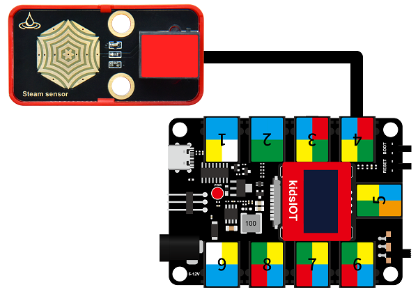

Test Code

Open KidsBlock and connect the board to your computer. Click **File --> Load from your computer**.

Choose D:\Code\2.Code_kidsIOT to open **3.5Steam sensor.sb3** file.

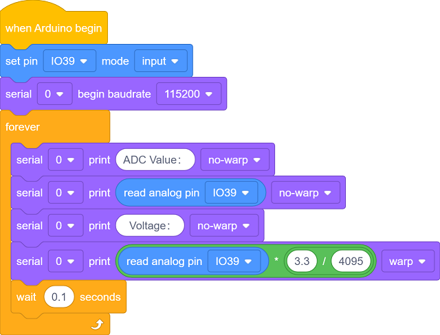

Click to connect to port and then .

Explanations

**Code Blocks**

|              Blocks               |              Code block               |
| :-------------------------------: | :-----------------------------------: |
|        |              |
|                  |          |
|                  |    |
|        |  |
|        |  |
|  |            |
|  |        |
|      |          |
|      |                |

**Conceive:**

1. **Initialization**

   Set pins and modes, initialize the serial port.

   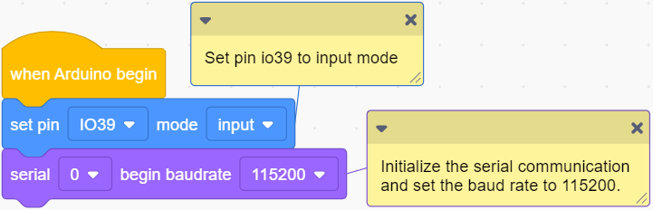

2. **Main Code**

   Loop: print the analog value read by the sensor and the voltage converted from the analog value. The results will be refreshed every 0.1s.

   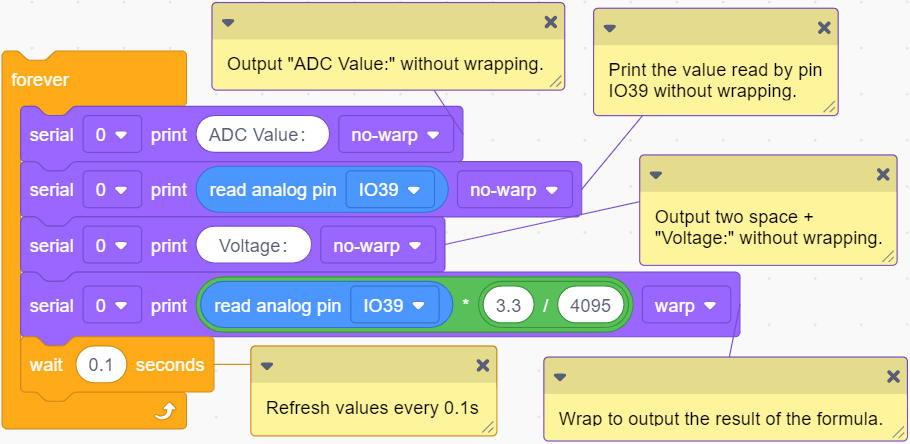

    

   **Build blocks:**

   ① Drag blocks and build as follows:

   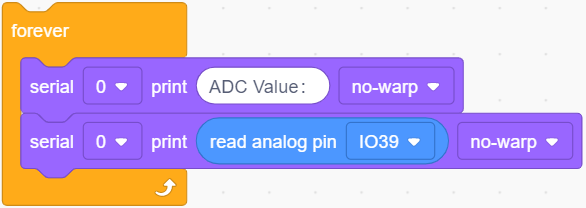
   
   
   
    reads analog values.
   
   
   
   Connect steam sensor to pin IO39, read and output the value of pin IO39.
   
   ② Drag blocks and build as follows:
   
   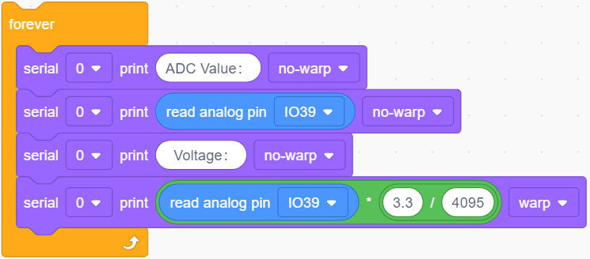
   
   
   
   : the two value will be multiplied.
   
   : the left value will divide by the right value. 
   
   
   
   Voltage value of a single scale = $\frac{3.3}{4095}$ , shown as below:
   
   
   
   input voltage = read analog value * voltage value of a single scale:
   
   
   
   the output value will be a input voltage value in the unit of V.
   
   ③ Add a delay  and set it to 0.1s. The results will be refreshed every 0.1s.

Test Result

Set baud rate before uploading code to avoid garbled words.

Click  to set Buadrate to 115200.

After uploading the code, the monitor outputs the detected analog values of water/vapor and the converted voltage values.

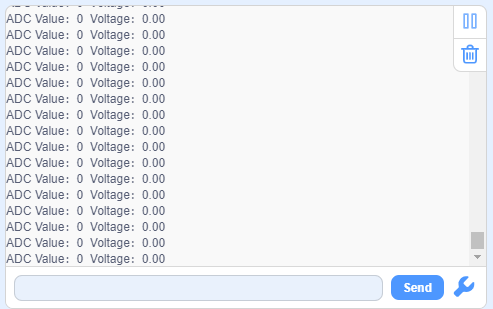

The more the amount of water is / the wetter the air is, the greater the analog and voltage value will be.

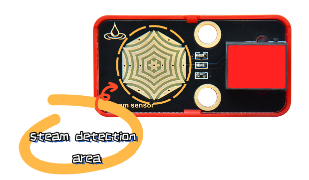

Breath on the detection area, or touch it with a wet tissue, and you will see the analog value ans voltage will both increase.

**ATTENTION: Be careful when using water, please do not to drip to any other place outside the detection area to aviod a short circuit.**

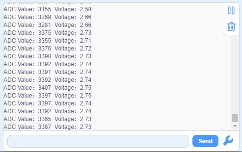

---

 3.6 Flame Sensor

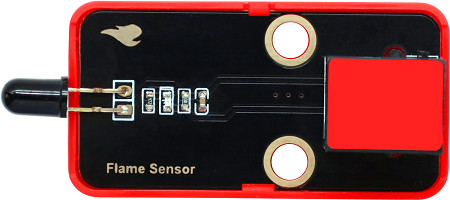

Since a far-infrared flame probe is reserved, the flame sensor is particularly sensitive to the flame spectrum, so this sensor is an essential part of the fire-fighting robot to find the fire source.

Parameters

Operating voltage: DC 3.3 ~ 5V 

Current: 1.2 mA

Maximum power: 0.006 W

Detection flame wavelength: 760 nm ~ 1100 nm

Detection range: 0 ~ 60 mm

Detection Angle: about 60°

Operating temperature: -10°C ~ +50°C

Dimensions: 48 x 24 x 18 mm

Positioning hole: diameter of 4.8mm

Interface: Telephone socket

Principle

The sensitive element of the sensor is a special infrared receiving diode, which is very sensitive to the infrared generated by the flame. It detects flame by converting the brightness of the flame into power level signals.

Modules with red housing are analog ones, so we should connect to analog io pins of the mainboard (ports with red).

In this experiment, we connect the module to port 6. According to the board ports view, the analog io pin at port 6 is io36.

Wiring Diagram

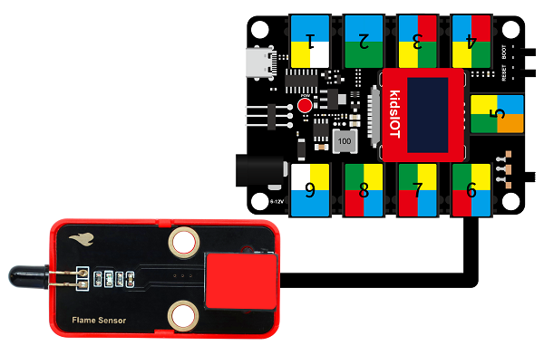

Test Code

Open KidsBlock and connect the board to your computer. Click **File --> Load from your computer**.

Choose D:\Code\2.Code_kidsIOT to open **3.6Flame sensor.sb3** file.

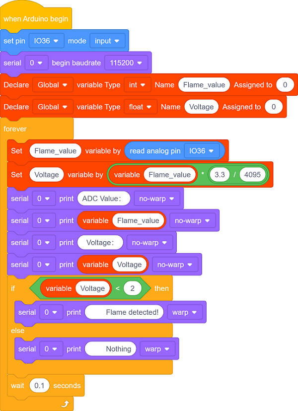

Click to connect to port and then .

Explanations

**Code Blocks**

|              Blocks               |               Code block                |
| :-------------------------------: | :-------------------------------------: |
|        |                |
|                  |            |
|                  |      |
|            |  |
|            |    |
|            |          |
|        |    |
|        |    |
|  |              |
|  |          |
|  |                  |
|      |            |
|      |              |
|      |                  |

**Conceive:**

1. **Initialization**

   Set pins and modes, initialize the serial port and create variables.

   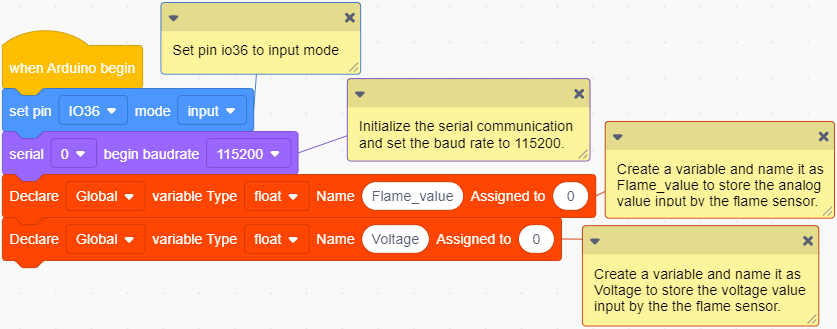

   

    creates a variable.

   - 

     Define the variable is global or local.

   - 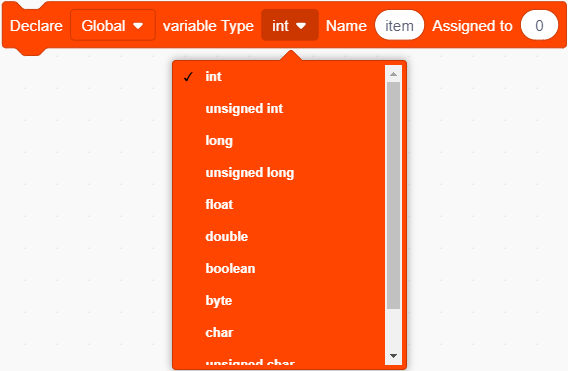

     Set the variable type.

   - 

     Name the variable.

   - 

     Assign an initial value.

   

   

   Create a float variable named *Flame_value* to store the analog value of flame sensor, with an initial value of 0.

   

   Create a float variable named *Voltage* to store the input voltage of the flame sensor, with an initial value of 0.

2. **Main Code**

   Loop: print the analog value read by the sensor and the voltage converted from the analog value. The results will be refreshed every 0.1s.

   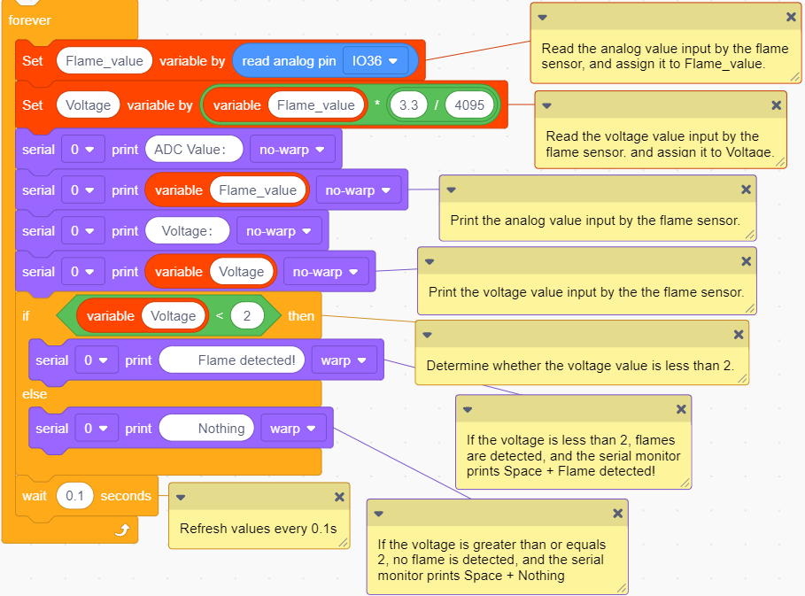

    

   **Build blocks:**

   ① Drag blocks and build as follows:

   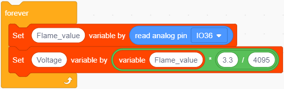

   

    set variable and assign to it.

    is a variable block.

   

   Connect the flame sensor to pin io36, read the analog value of pin io36 and assign it to the variable *Flame_value*.

   

   Assign the calculated voltage value to the variable *Voltage* .

   ② Drag blocks and build as follows:

   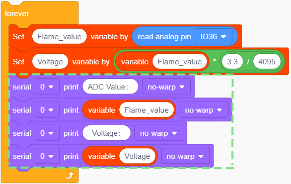

   Print the analog value and the voltage value.

   ③ Drag blocks and build as follows:

   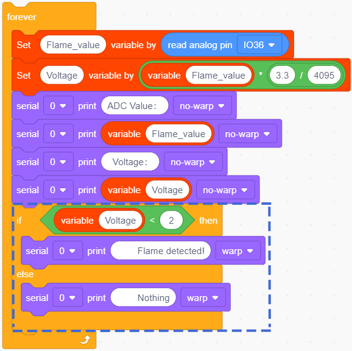
   
   
   
    determines whether left value of less than the right one. If yes, the condition will be output true.
   
   
   
   When flame is detected, the voltage decrease. The brighter the flame is, the lower the voltage will be output. 
   
   In this experiment, we set the threshold voltage value to 2 (you can modify this value according to needs), so when the voltage is lower than 2, the flame is detected.
   
   We add an **if else** block to determine whether the voltage output is lower than 2. The voltage is a float value so it is more accurate.
   
   If voltage < 2, the serial monitor will display *Flame detected!* ; When voltage ≥ 2, it will prints *Nothing* .
   
   ④ Add a delay  and set it to 0.1. The results will be refreshed every 0.1s.

Test Result

Set baud rate before uploading code to avoid garbled words.

Click  to set the Buadrate to 115200.

After uploading the code, *Flame detected!* will be displayed on the serial monitor when the flame sensor detects flame.

If no flame is detected, the serial monitor shows *Nothing*.

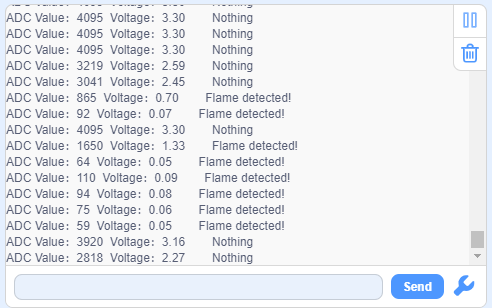

---

3.7 Sound Sensor

The sound sensor acts as a microphone that can capture sound information in the environment.

It is consists of a sensitive capacitor microphone for detecting sound and an amplification circuit. It works based on the propagation and vibration of sound. When sound travels near the sensor, the sound wave causes the sensor to vibrate. Then, the sensor converts sound vibrations into electrical signals and sends them for further processing or analysis.

Parameters

Operating voltage: DC 3.3 ~ 5V 

Current: 15 mA

Maximum power: 0.075 W

Operating temperature: -10°C ~ +50°C

Dimensions: 48 x 24 x 18 mm

Positioning hole: diameter of 4.8mm

Interface: Telephone socket

Principle

When you speak loudly or play music to the MIC, these sound signals are converted into electrical ones, which are output at analog ports.

The amplifier circuit on the module amplifies the sound detected by the MIC. We can adjust the amplification by rotating the potentiometer. It is the maximum when we adjust the potentiometer clockwise to the end.

Modules with red housing are analog ones, so we should connect to analog io pins of the mainboard (ports with red).

In this experiment, we connect the module to port 7. According to the board ports view, the analog io pin at port 7 is io35.

Wiring Diagram

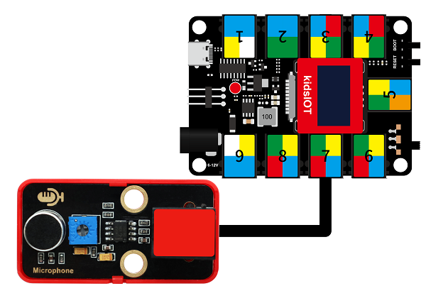

Test Code

Open KidsBlock and connect the board to your computer. Click **File --> Load from your computer**.

Choose D:\Code\2.Code_kidsIOT to open **3.7Sound sensor.sb3** file.

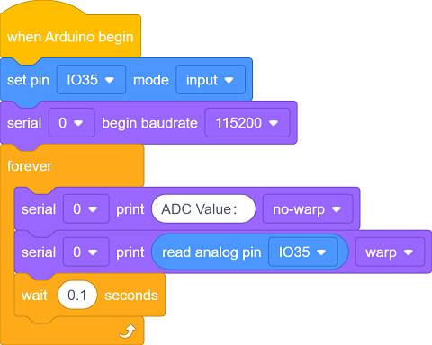

Click to connect to port and then .

Explanations

**Code Blocks**

|            Blocks             |              Code block               |
| :---------------------------: | :-----------------------------------: |
|    |              |
|              |          |
|              |    |
|    |  |
|    |  |
|  |          |
|  |                |

**Conceive:**

1. **Initialization**

   Set pins and modes, initialize the serial port.

   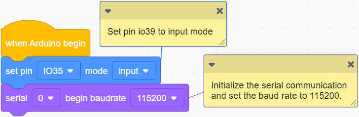

2. **Main Code**

   Loop: print the analog value read by the sound sensor every 0.1s.

   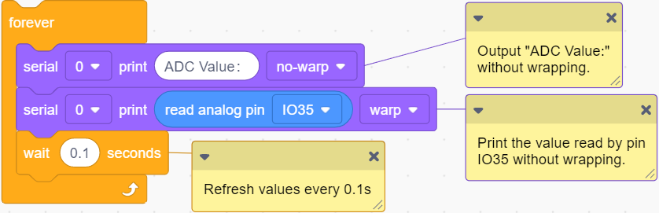

Test Result

Set baud rate before uploading code to avoid garbled words.

Click  to set the Buadrate to 115200.

After uploading the code, speak to the MIC, and monitor will display the analog value of sound volume that is detected by the sound sensor.

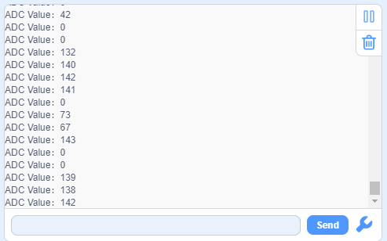

---

3.8 Ultraviolet Sensor

In the solar spectrum, the frequency of ultraviolet is higher than that of visible light, so it is invisible. 

Ultraviolet light can be divided into UVA, UVB, UVC, EUV. Among them, UVA causes tanning; UVB may burn skin due to its shorter wavelength; UVC is normally blocked by the ozone layer. 

Through ultraviolet radiation, the skin will produce more melanin, which is distributed upward into the cuticle of the epidermis to form brown spots. So it is the biggest culprit of skin wrinkles, aging or sagging.

But it's not all bad. When ultraviolet light hits the body, it can promote the synthesis of vitamin D to prevent rickets. Besides, it harbors bactericidal efficacy, so some hospitals disinfect by ultraviolet light. In spite of its benefits, too strong ultraviolet will harm the human body, leading to a skin cancer.

Parameters

Operating voltage: DC 3.3 ~ 5V 

Operating current: 1 mA

Operating power: 0.005 W

Peak wavelength: 355 nm

Peak response rate: 0.18A/W (at 355 nm)

Spectral response range: 280 ~ 370 nm

Active region: 0.076 mm²

Responsivity: 0.14 A/W (test under λ = 300 nm, U~R~ = 0 V)

Dark current: 1nA (test under U~R~ = 0.1 V )

Light current: 113 nA (test under UVA light, 1 mW/cm); 26 nA (test under 1 UVI)

Temperature coefficient: 0.08 %/°C 

Operating temperature: -10°C ~ +50°C

Output signal: Analog signal

Dimensions: 48 x 24 x 18 mm (without housing）

Positioning hole: diameter of 4.8mm

Interface: Telephone socket

Principle

This ultraviolet sensor measures the intensity of ultraviolet light and converts it into electrical outputs.

The relationship between the output voltage of the UV sensor and the UV index:

Comparison Table of Voltage and UV index

We can have a clearly look of the UV index corresponding to the output voltage. The voltage is in the unit of mV.

Modules with red housing are analog ones, so we should connect to analog io pins of the mainboard (ports with red).

In this experiment, we connect the module to port 8. According to the board ports view, the analog io pin at port 8 is io34.

Wiring Diagram

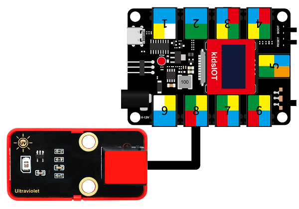

Test Code

Open KidsBlock and connect the board to your computer. Click **File --> Load from your computer**.

Choose D:\Code\2.Code_kidsIOT to open **3.8Solar ultraviolet sensor.sb3** file.

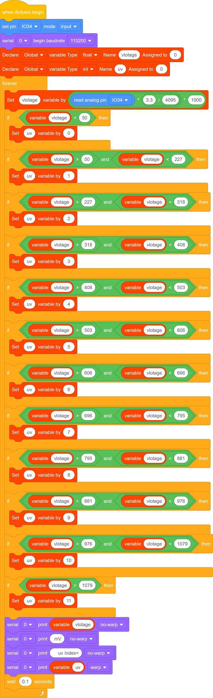

Click to connect to port and then .

Explanations

**Code Blocks**

|              Blocks               |               Code block                |
| :-------------------------------: | :-------------------------------------: |
|        |                |
|                  |      |
|            |  |
|            |    |
|            |          |
|        |    |
|        |    |
|  |              |
|  |          |
|  |                  |
|  |            |
|  |                    |
|      |            |
|      |                      |
|      |                  |

**Conceive:**

1. **Initialization**

   Initialize serial port.

   Create a float variable *voltage* to store the input voltage of the ultraviolet sensor. Assign an initial value of 0 to it.

   Create an integer variable *uv* to store the detected UV index. Assign an initial value of 0 to it.

   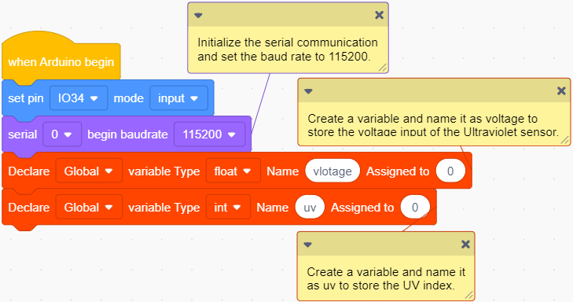

   

2. **Main Code**

   Loop: print the analog value read by the sensor and the voltage converted from the analog value. The results will be refreshed every 0.1s.

   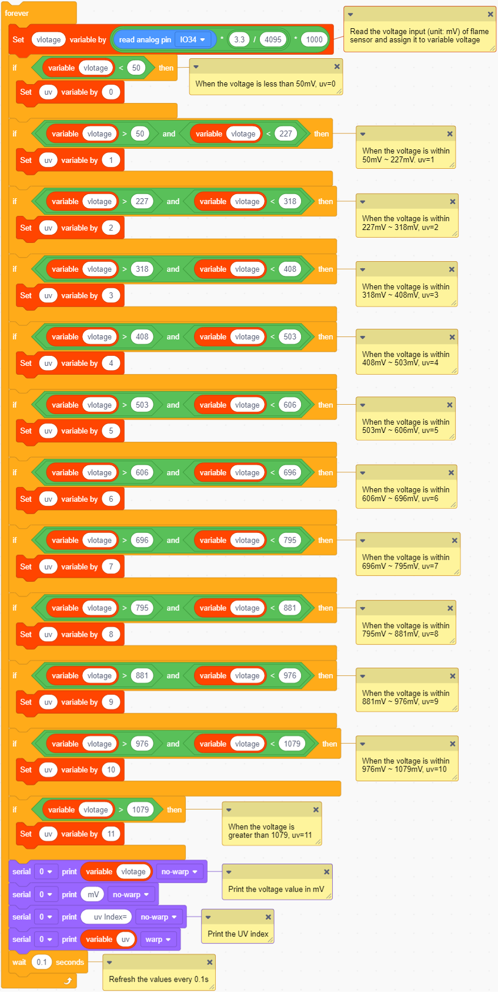

    

   **Build blocks:**

   ① Drag blocks and build as follows:

   

   Connect the UV sensor to pin A7, read the analog value of pin A7 and convert it into voltage.

   

   The voltage unit in the Comparison Table is millivolt(mV), so we convert the analog value read by the sensor into voltage in mV. We only need to multiply the value by 1000.

   

   Assign the converted value to variable *Voltage*.

   ② Drag blocks and build as follows:

   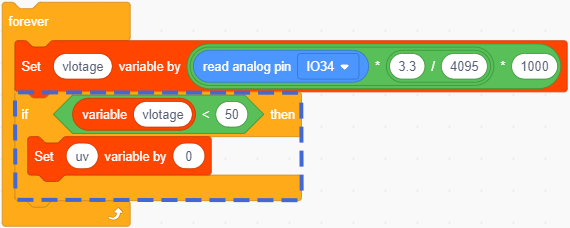

   

   

   If the condition is True, execute the blocks in "if".

   If the condition is False, skip this block.

   

   If the voltage is lower than 50mV, UV index = 0

   ③ Drag blocks and build as follows:

   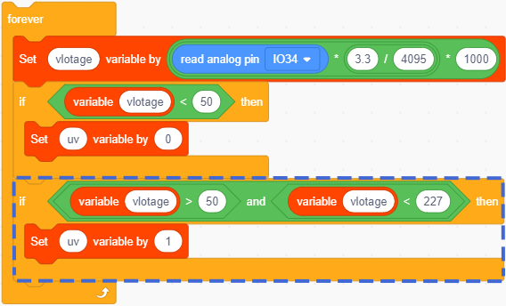

   

    determines whether the left value is greater than the right value. If yes, the condition will be output true.

   : Only when the two conditions are both satisfied, it outputs True.

   

   When the voltage is greater than 50 but lower than 227, UV index = 1.

   ④ Duplicate the block.
   
   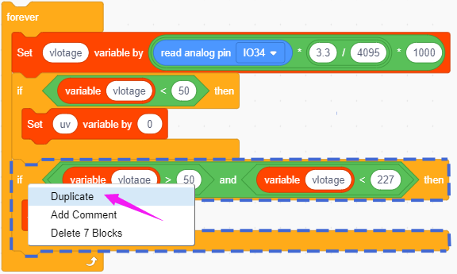
   
   As follows:
   
   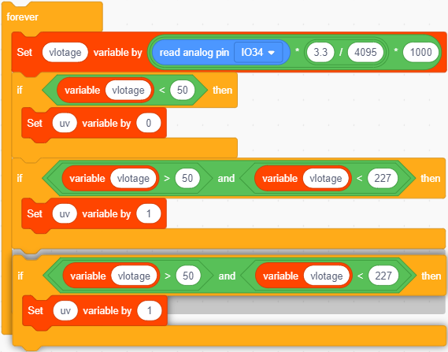
   
   Duplicate for 10 times and set the condition according to the Comparison Table:
   
   If voltage < 50 is True, uv = 0.
   
   If voltage > 50 and voltage < 227, uv = 1.
   
   If voltage > 227 and voltage < 318, uv = 2.
   
   ... ...
   
   If voltage > 976 and voltage < 1079, uv = 10.
   
   If voltage > 1079, uv = 11.
   
   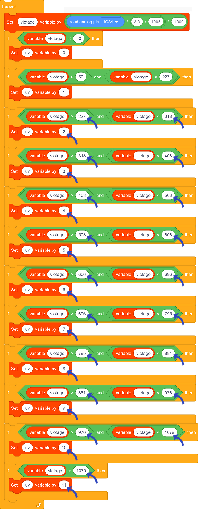
   
   We adopt **if** block to determine the range of the UV index.
   
   ⑤ Put into **forever**, as follows:
   
   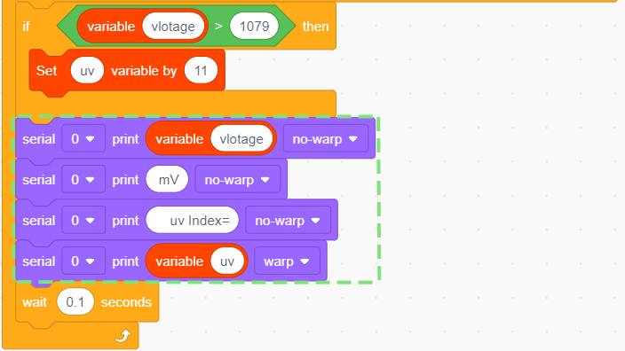
   
   Serial monitor prints the voltage value and UV index and refreshes the results every 0.1s.

Test Result

Set baud rate before uploading code to avoid garbled words.

Click  to set the Buadrate to 115200.

After uploading the code, the monitor prints the UV index and the voltage value (mV) converted from analog values of the sensor.

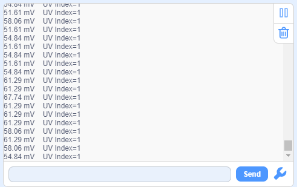

---

3.9 Traffic Light Module

A traffic light acts as a signal that commands the traffic operation, which is generally composed of red, green and yellow light. Red indicates traffic-prohibited, green means traffic-permitted, and yellow is a warning signal.

This traffic light module is also composed of red LED, yellow and green LED, whose working principle is consistent with that of white LED module.

Parameters

Operating voltage: DC 3.3 ~ 5V 

Operating current: 40 mA

Maximum power: 0.2 W

Operating temperature: -10°C ~ +50°C

Dimensions: 48 x 24 x 18 mm (without housing)

Positioning hole: diameter of 4.8mm

Interface: Telephone socket

Principle

The port of this module is in white, so we need to connect it to the white ports on the board.

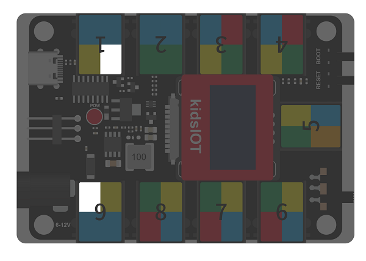

In this experiment, we connect the module to port 9. According to the order of the pins, the red LED is connected to pin io17, yellow to pin io18, and green to io19.

When the mainboard inputs high(1) to the module, the connected LED will light up. If it is low(0), the related LED will go off.

Wiring Diagram

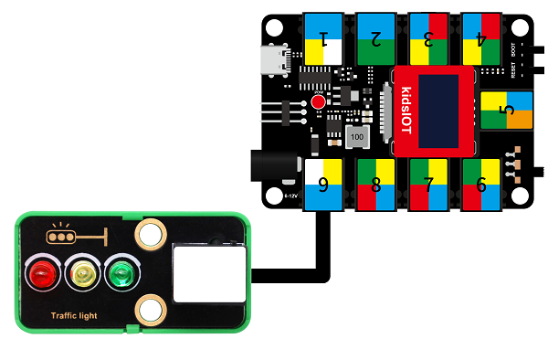

Test Code

Open KidsBlock and connect the board to your computer. Click **File --> Load from your computer**.

Choose D:\Code\2.Code_kidsIOT to open **3.9Traffic light module.sb3** file.

Click to connect to port and then .

Explanations

**Code Blocks**

|            Blocks             |          Code block           |
| :---------------------------: | :---------------------------: |
|    |      |
|              |  |
|              |    |
|  |  |
|  |        |
|  |    |

**Conceive:**

1. **Initialization**

   Set pins and modes.

   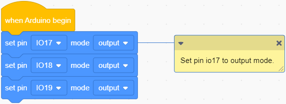

2. **Main Code**

   Loop: red LED lights up for 5s; yellow LED blinks for 3 times; green LED lights up for 5s.

   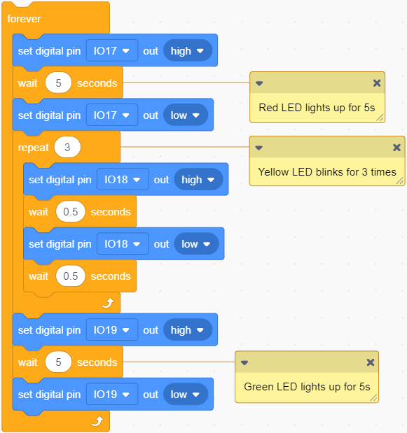

    

   **Build blocks:**

   ① Drag blocks and build as follows:

   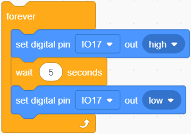

   Set pin IO17 to output high for 5s and then output low: red LED lights up for 5s and goes off.

   ② Drag blocks and build as follows:

   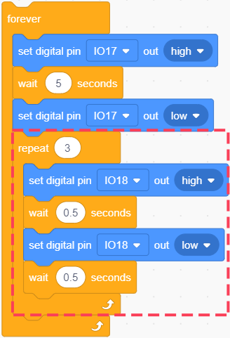

   

   : codes in this block will run repeatedly, and the times can be set.

   

   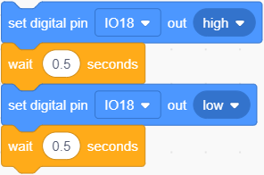

   The yellow LED turns on for 0.5s and off for 0.5s (blinks for 1s).

   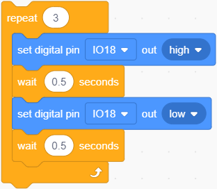

   Set the times to 3, so the yellow LED blinks for 3 times.

   ③ Drag blocks and build as follows:

   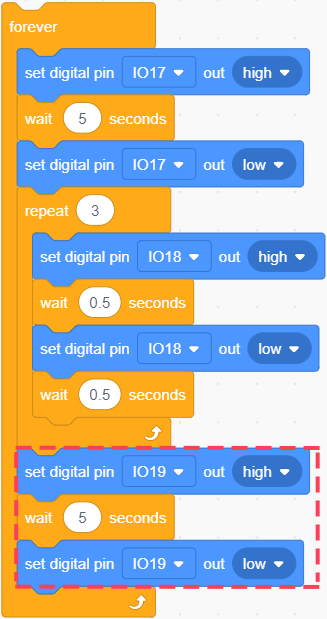

   The green LED lights up for 5s and goes off.

Test Result

After uploading the code, repeat these actions: the red LED lights up for 5s, yellow one blinks for 3 times and green LED lights up for 5s. 

---

3.10 LPS331APTR Air Pressure Sensor

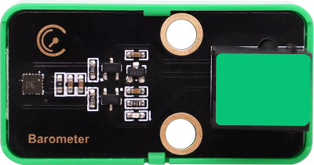

Air pressure effects human health physiologically and psychologically.

Low pressure, on the one hand, influences the supply of oxygen. When human body lacks of oxygen, especially the brain, symptoms such as dizziness, headache, nausea, vomiting and weakness may be developed. On the other hand, impairments may also located in the nervous system. Even lung edema and coma may occur, which is commonly known as the "mountain reaction".

High pressure is also having a deleterious effect. It may lead to tinnitus, dizziness, and even the rupture of the eardrum; Decompression sickness can occur if decompression is not done properly after working in a high pressure environment.

Beyond that, air pressure will also change people's psychological moods, causing depressed emotions.

Parameters

Operating voltage: DC 3.3 ~ 5V

Operating current: 30 uA

Maximum power: 0.000015 W

Working pressure range: 260 ~ 1260 mbar

Operating temperature: -10°C ~ +50°C

Dimensions: 48 x 24 x 18 mm (without housing)

Positioning hole: diameter of 4.8mm

Interface: Telephone socket

Principle

LPS331APTR module is with green housing, which is an I2C communication sensor, so we should connect to ports with green on the board.

In this experiment, we connect it to port 5.

Before using, we need to import LPS331AP library.

Wiring Diagram

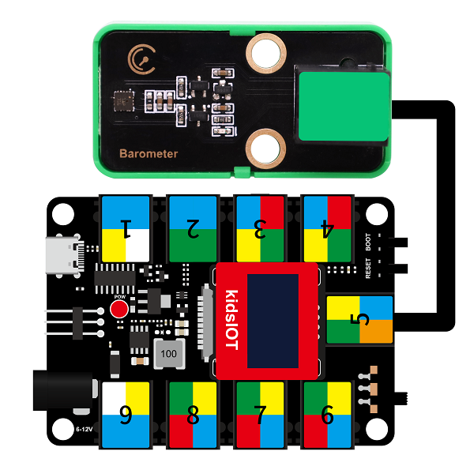

Test Code

Open KidsBlock and connect the board to your computer. Click **File --> Load from your computer**.

Choose D:\Code\2.Code_kidsIOT to open **3.10Air pressure detection.sb3** file.

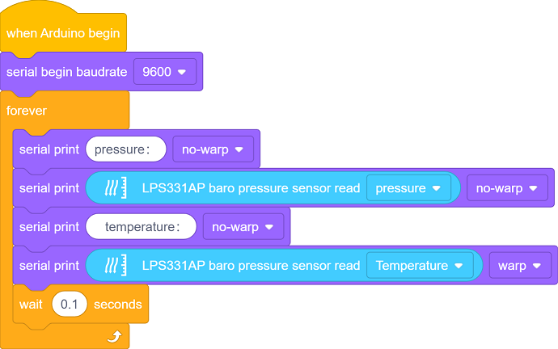

Click to connect to port and then .

Explanations

**Code Blocks**

|             Blocks              |           Code block            |
| :-----------------------------: | :-----------------------------: |
|      |        |
|  |  |
|    |    |
|    |          |

**Conceive:**

Add library first, Click  to load library **lps331ap**.

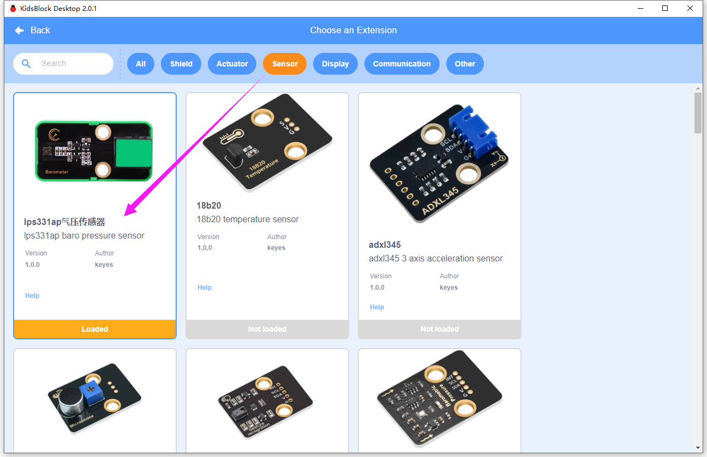

1. **Initialization**

   Initialize the serial port.

   

2. **Main Code**

   Loop: print the air pressure value and temperature value read by the LPS331APTR sensor. The results will be refreshed every 0.1s.

   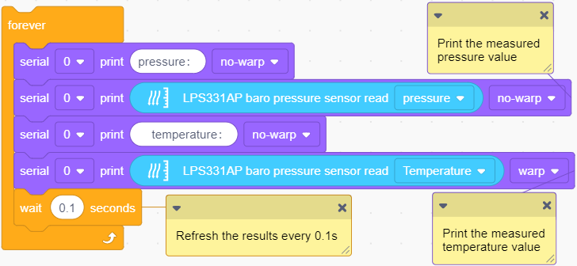

Test Result

Set baud rate before uploading code to avoid garbled words.

Click  to set the Buadrate to 115200.

After uploading the code, the monitor outputs the pressure and temperature value and refreshes them every 0.1s.

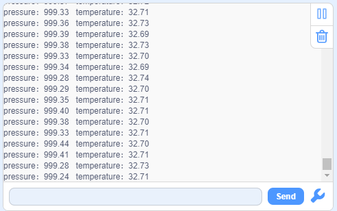

Touch the sensing area with your finger, and you will see the temperature value rises.

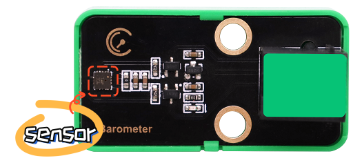

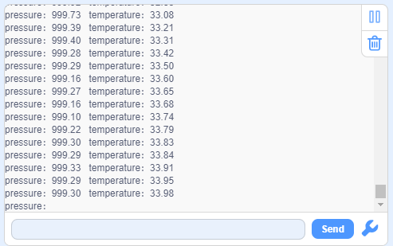

---

## 4. Comprehensive Experiments

4.1 Rain Detection

This station monitors weather conditions in real time.

In this experiment, we combine a steam sensor and a passive buzzer to achieve a rain detection function for this mini meteorological station. When the steam sensor detects rain, the buzzer alarms. 

Flow

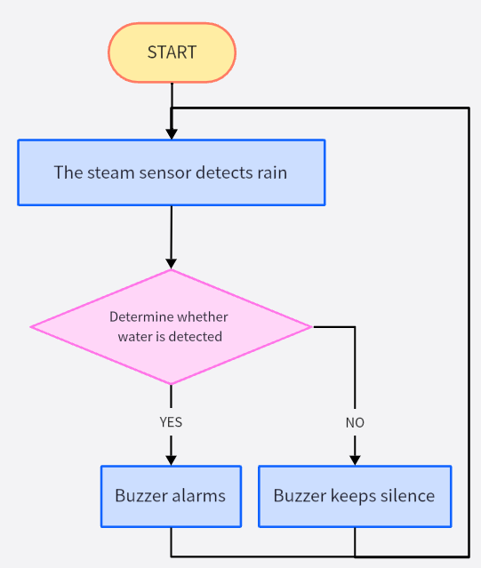

Assembly

**Required Parts**

**Step 1**

**Step 2**

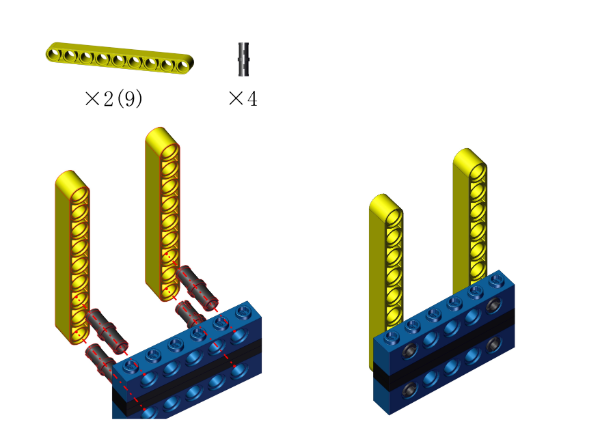

**Step 3**

**Step 4**

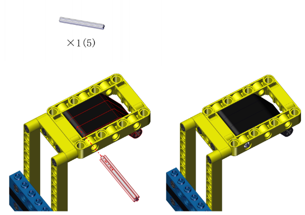

**Step 5**

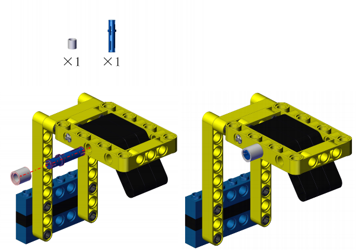

**Step 6**

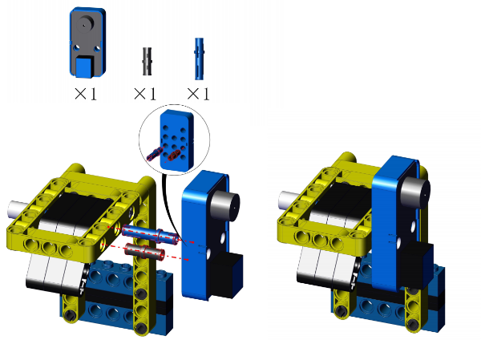

**Step 7**

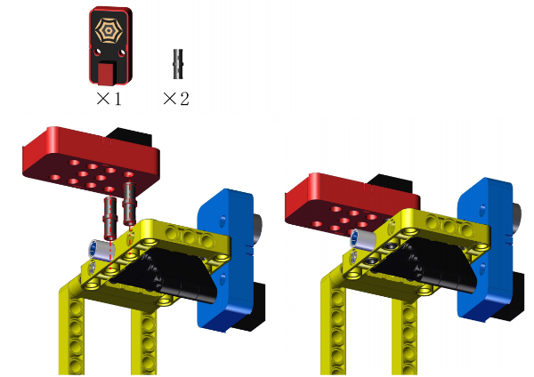

**Step 8**

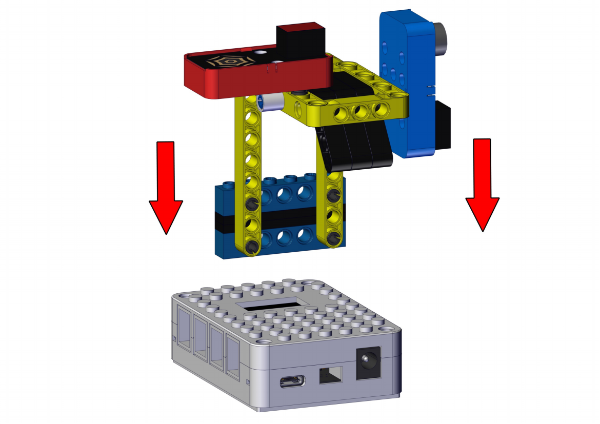

**Completed**

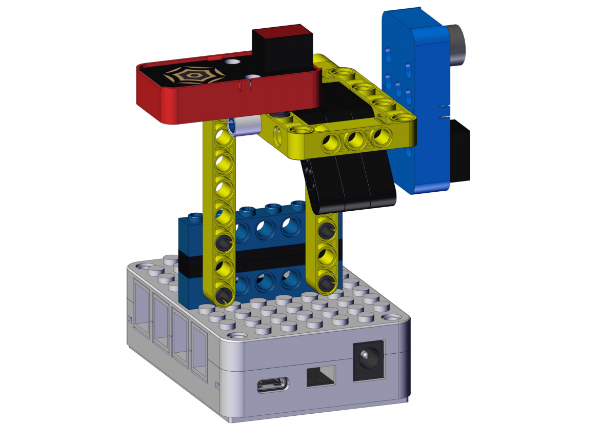

Wiring Diagram

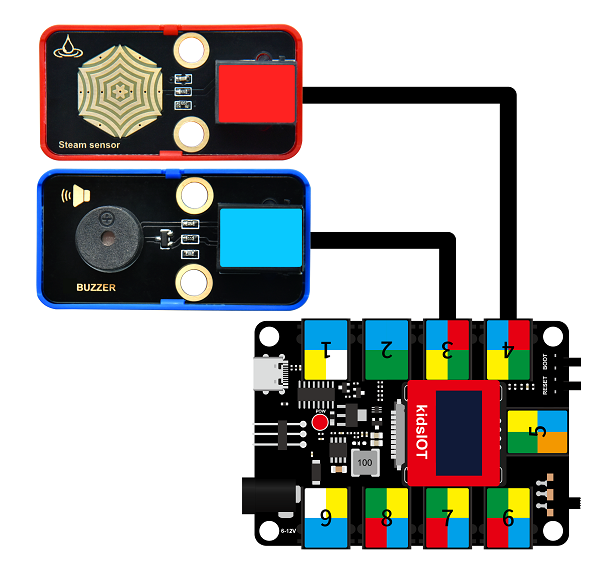

Test Code

Open KidsBlock and connect the board to your computer. Click **File --> Load from your computer**.

Choose D:\Code\2.Code_kidsIOT to open **4.1Rain detection.sb3** file.

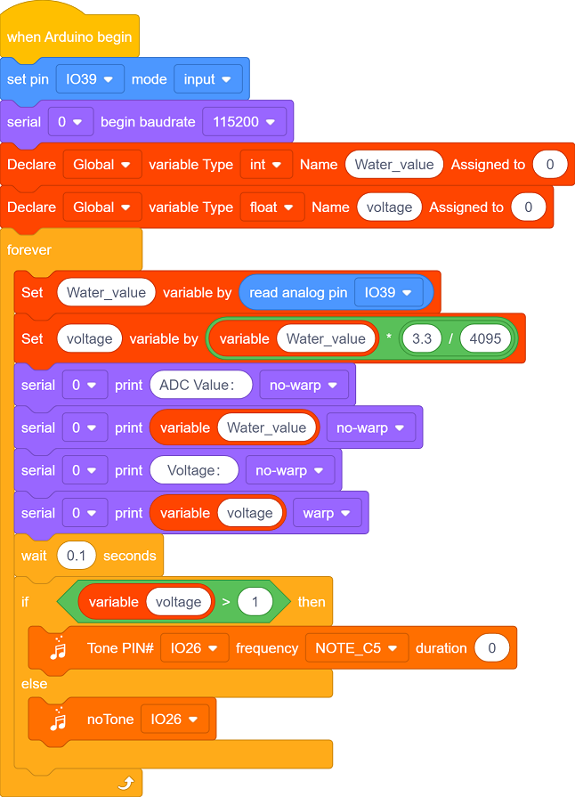

Click to connect to port and then .

Explanations

**Conceive:**	

Set a threshold of voltage to determine the water volume. When there is too much water, the voltage exceeds the threshold, rain is detected, and the buzzer alarms. The buzzer will stop alarming when the voltage is lower than the threshold.

**Code structure:**

1. Initialization. Set the pins of the steam sensor and the passive buzzer, set the voltage value of a single scale, and set the frequency of the passive buzzer.

   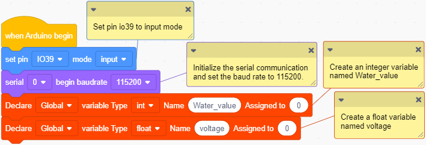

2. Loop.

   Print the analog value and voltage of the steam sensor.

   Determine whether the voltage exceeds 1 (Herein, we set 1 as the threshold, which is adjustable according to needs).

   - voltage > 1: buzzer alarms.
   - voltage ≤ 1: buzzer does not emit sounds.

   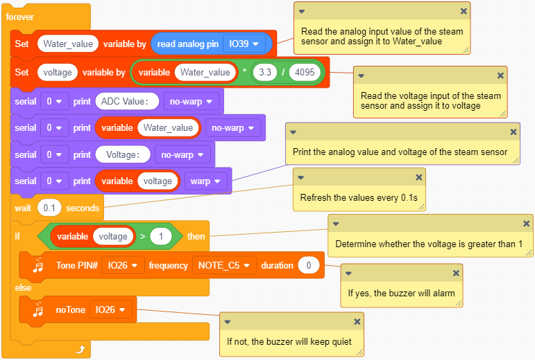

Test Result

After uploading the code, the steam sensor will detects the ambient water volume and converts it to a voltage output. When the voltage is greater than 1, the buzzer alarms. If not, the buzzer will not emit sounds.

**ATTENTION: Be careful when using water, please do not to drip to any other place outside the detection area to aviod a short circuit.**

---

4.2 Fire Alarm

The fire alarm system of the station can effectively prevent and deal with forest fires.

In this experiment, we build a fire alarm with a flame sensor and a passive buzzer. When flame is detected, the buzzer will emit sounds for alarming. 

Flow

Assembly

**Required Parts**

**Step 1**

**Step 2**

**Step 3**

**Step 4**

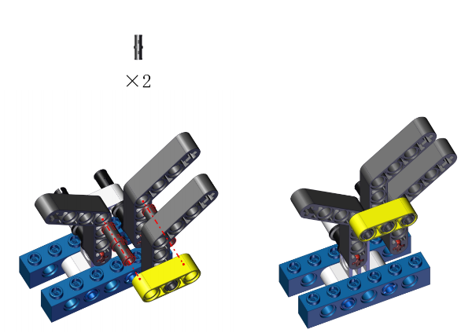

**Step 5**

**Step 6**

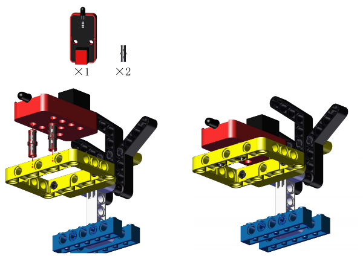

**Step 7**

**Step 8**

**Completed**

Wiring Diagram

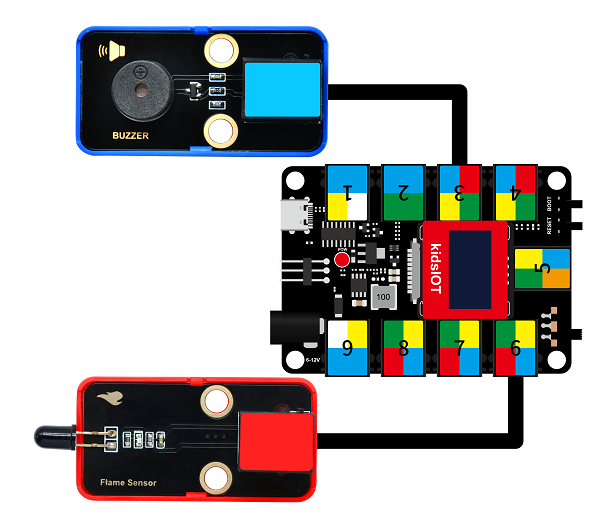

Test Code

Open KidsBlock and connect the board to your computer. Click **File --> Load from your computer**.

Choose D:\Code\2.Code_kidsIOT to open **4.2Fire alarm.sb3** file.

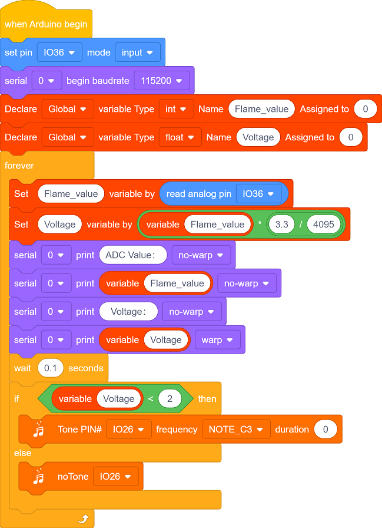

Click to connect to port and then .

Explanations

**Conceive:**

Set a threshold of voltage to determine whether there is flame. When the sensor detects flame, the voltage is lower than the threshold, and the buzzer alarms. The buzzer will stop alarming when the voltage exceeds the threshold (the sensor detects no flame).

**Code structure:**

1. Initialization. Set the pins of the flame sensor and the passive buzzer, set the voltage value of a single scale, and set the frequency of the passive buzzer.

   

2. Loop.

   Print the analog value and voltage of the flame sensor.

   Determine whether the voltage is lower than 2 (Herein, we set 2 as the threshold, which is adjustable according to needs).

   - voltage < 2: buzzer alarms.
   - voltage ≥ 2: buzzer does not emit sounds.
   
   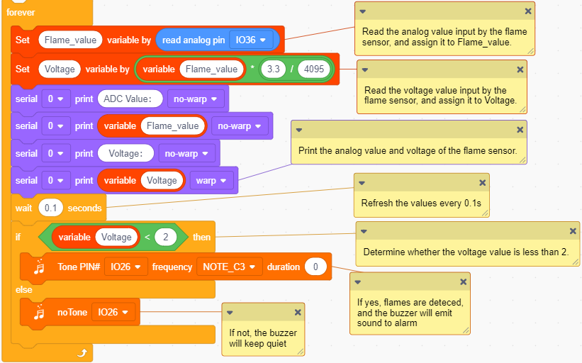

Test Result

Upload the code. When the flame sensor detects flame, the voltage will lower than 2, and the buzzer will alarm. If not, the buzzer will not emit sounds.

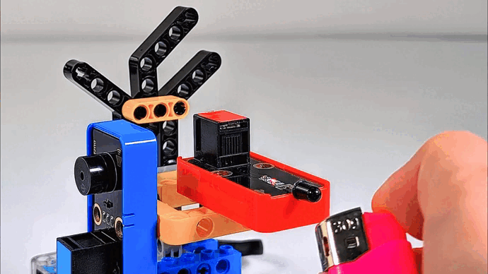

---

4.3 Magnetic Field Detection

After the lightning strike, a certain amount of electricity will generated in the surrounding, and a strong magnetic field will be produced in an instant. 

This magnetic field interferes with the connection of the relevant equipment of the station, thus disabling the automatic devices. Therefore, it is necessary to detect the magnetic field at all times and alarm immediately when the magnetic field is detected.

In this experiment, we utilize a Hall sensor and a white LED module to detect magnetic field. When the Hall sensor detects a magnetic field, the white LED lights up.

Flow

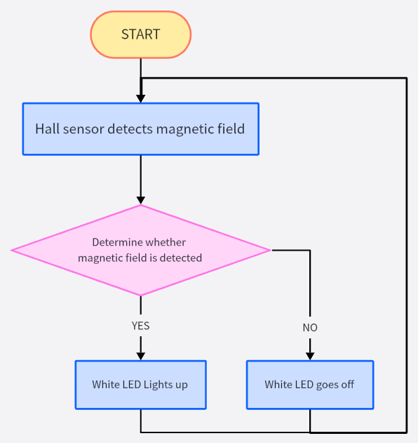

Assembly

**Required Parts**

**Step 1**

**Step 2**

**Step 3**

**Step 4**

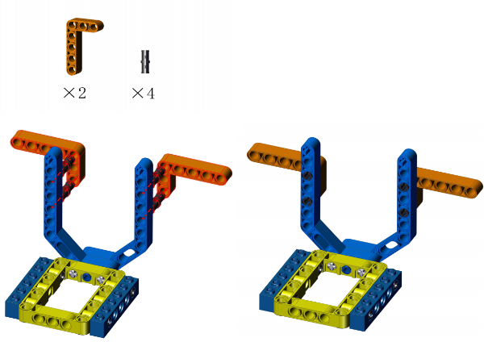

**Step 5**

**Step 6**

**Step 7**

**Completed**

Wiring Diagram

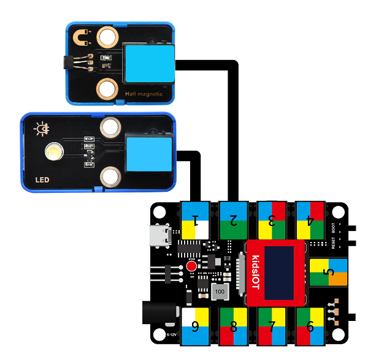

Test Code

Open KidsBlock and connect the board to your computer. Click **File --> Load from your computer**.

Choose D:\Code\2.Code_kidsIOT to open **4.3Magnetic field detection.sb3** file.

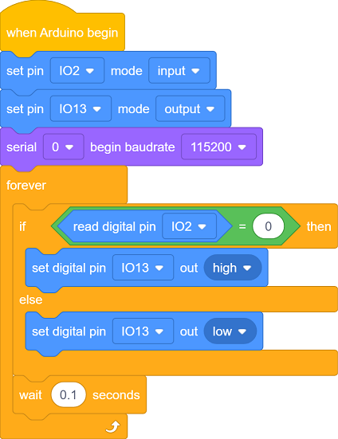

Click to connect to port and then .

Explanations

**Conceive:**

When the Hall sensor detects a magnetic field, a low power(0) will be output, and the white LED lights up. If there is no magnetic field, high(1) will be output, and the LED goes off.

**Code structure:**

1. Initialization. Set the pins of the Hall sensor and the white LED module.

   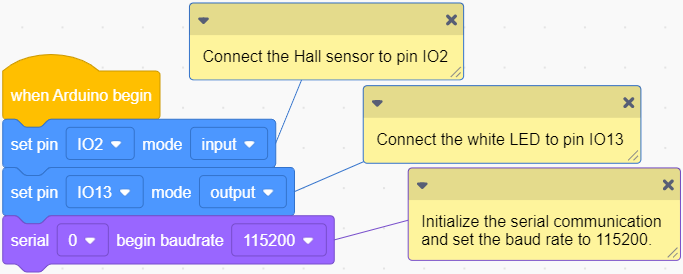

2. Loop.

   Print the digital value of the power level of the Hall sensor.

   Determine whether the value equals 0 (0 means a magnetic field is detected). 

   - value = 0: the white LED lights up.
   - value ≠ 0: the white LED goes off.

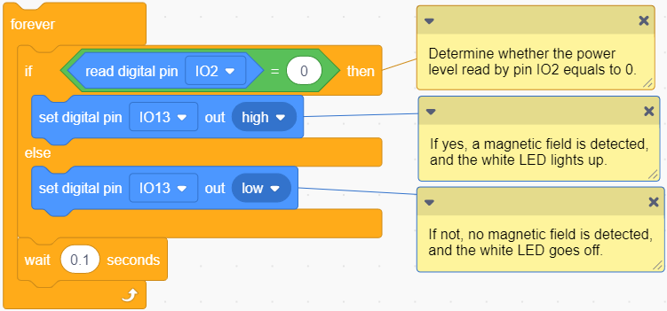

Test Result

After uploading the code, the Hall sensor starts to detect magnetic field.

If the sensor detects a magnetic field, the white LED will turn on. If not, the LED will go off.

---

4.4 Thunder Detection

Thunder is the atmospheric sound produced by lightning. When thunder is detected, it sends an alert that rain may be coming.

In this experiment, we integrate a sound sensor and a white LED module to construct a thunder detector. When the thunder volume exceeds a set threshold, the white LED will lights up.

Flow

Assembly

**Required Parts**

**Step 1**

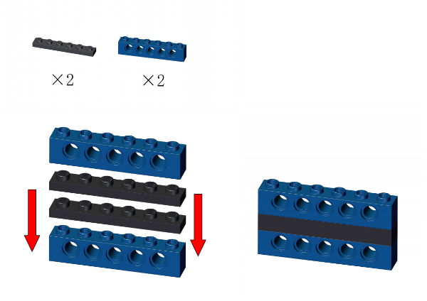

**Step 2**

**Step 3**

**Step 4**

**Step 5**

**Step 6**

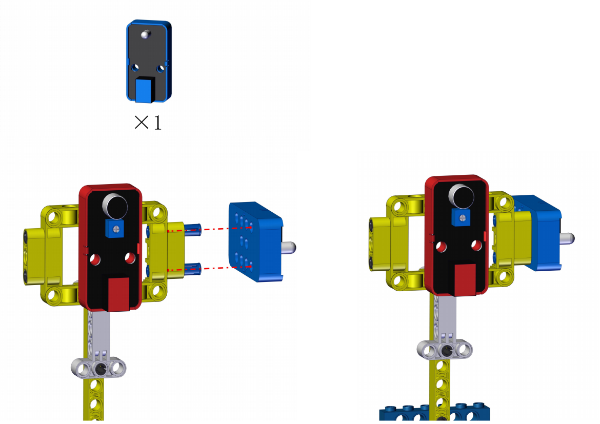

**Step 7**

**Completed**

Wiring Diagram

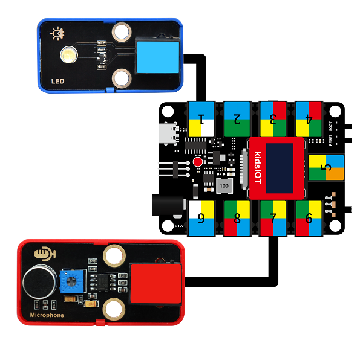

Test Code

Open KidsBlock and connect the board to your computer. Click **File --> Load from your computer**.

Choose D:\Code\2.Code_kidsIOT to open **4.4Sound detection.sb3** file.

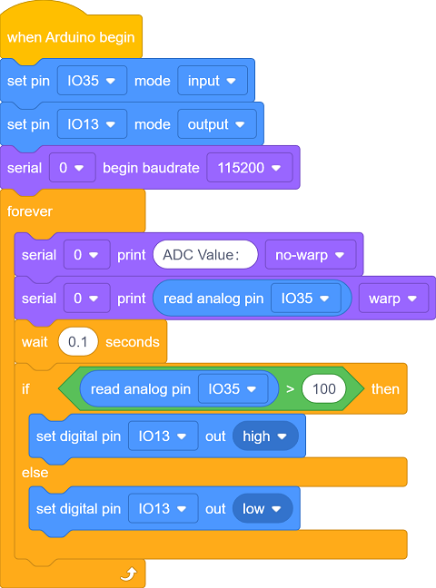

Click to connect to port and then .

Explanations

**Conceive:**

Set a threshold of analog value to determine the thunder volume. When thunder is detected, the analog value exceeds the threshold, and the white LED lights up as an alarm. The LED will go off when the value is lower than the threshold.

**Code structure:**

1. Initialization. Set the pins of the sound sensor and the white LED module.

   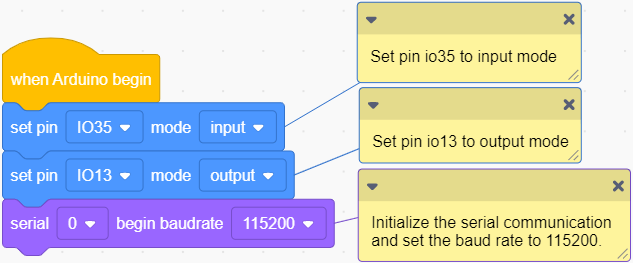

2. Loop.

   Print the analog value of sound volume detected by the sound sensor.

   Determine whether the analog value is greater than 100 (Herein, we set 100 as the standard threshold of thunder volume, which is adjustable according to needs).

   - analog value > 100, the white LED lights up.
   - analog value ≤ 100, the white LED goes off.
   
   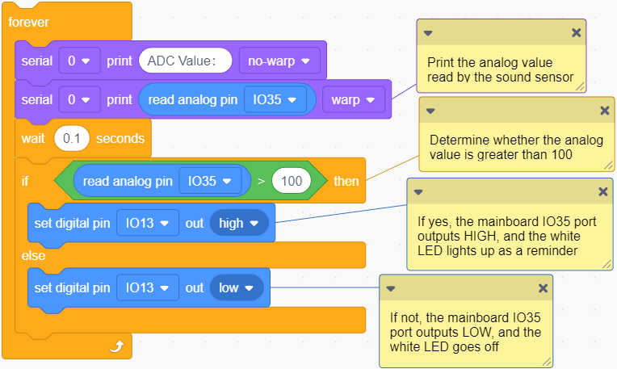

Test Result

After uploading the code, the sound sensor detects whether there is a thunder. When the analog value of the sound exceeds 100, a thunder is detected and the white LED will light up.

Here we stimulate thunder by playing music. When the value is greater than 100, LED lights up.

---

4.5 Temperature Detection

It is necessary to monitor the atmospheric temperature in the natural environment in real time. If the temperature is too high, disasters such as fire may occur. When the normal temperature is detected, the green LED lights up; the yellow LED is a reminder for raising temperature; if red LED is on, be very careful because it indicates a high temperature.

In this experiment, the XHT11 temperature and humidity sensor and the traffic light module to measure temperature range. Three colors of LED indicate three ranges of ambient temperature. 

Flow

Assembly

**Required Parts**

**Step 1**

**Step 2**

**Step 3**

**Step 4**

**Step 5**

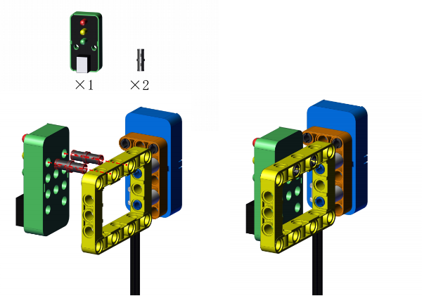

**Step 6**

**Completed**

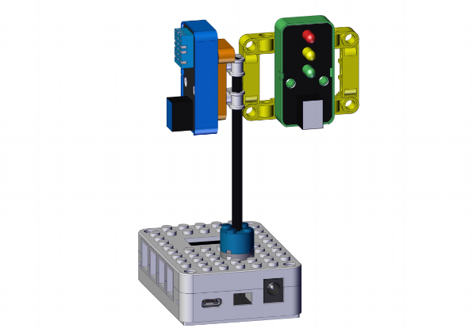

Wiring Diagram

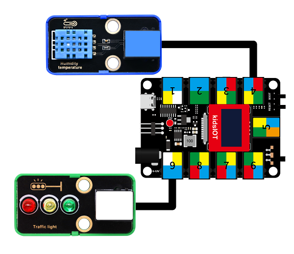

Test Code

Open KidsBlock and connect the board to your computer. Click **File --> Load from your computer**.

Choose D:\Code\2.Code_kidsIOT to open **4.5Temperature and humidity detection.sb3** file.

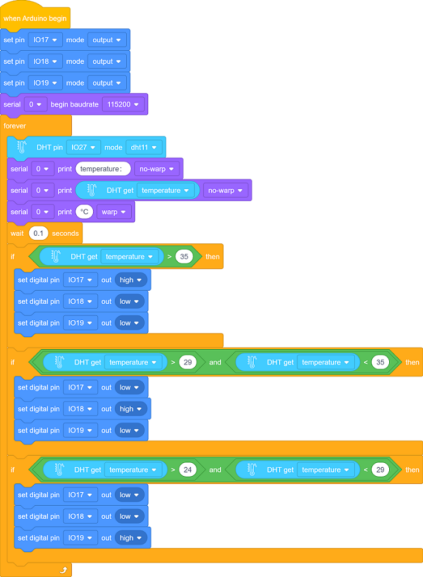

Click to connect to port and then .

Explanations

**Conceive:**

Set three thresholds to separate the temperature range: 24, 29, 35, which are adjustable according to needs.

- preference temperature: 24°C ~ 29°C
- warning temperature: 29°C ~ 35°C
- high temperature: over 35°C

Corresponding LED will light up when the ambient temperature is within the related ranges.

- Within preference temperature range: the green LED lights up
- Within warning temperature range: the yellow LED lights up.
- Within high temperature range: the red LED lights up.

**Code structure:**

1. Initialization. Set the pins of XHT11 temperature and humidity sensor and the traffic light module.

   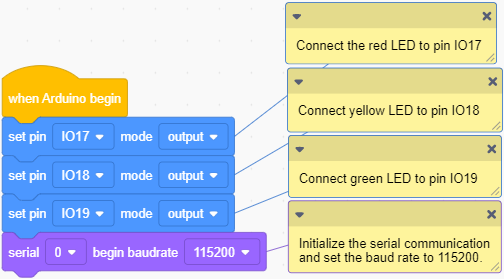

2. Loop.

   XHT11 sensor reads and outputs the temperature values.

   Determine which section the temperature value is in, so then light up corresponding LED.

   - 24°C ≤ temperature < 29°C: the green LED lights up and other LEDs are off.
   - 29°C ≤ temperature < 35°C: the yellow LED lights up and other LEDs are off.
   - temperature > 35°C: the red LED lights up and other LEDs are off.
   
   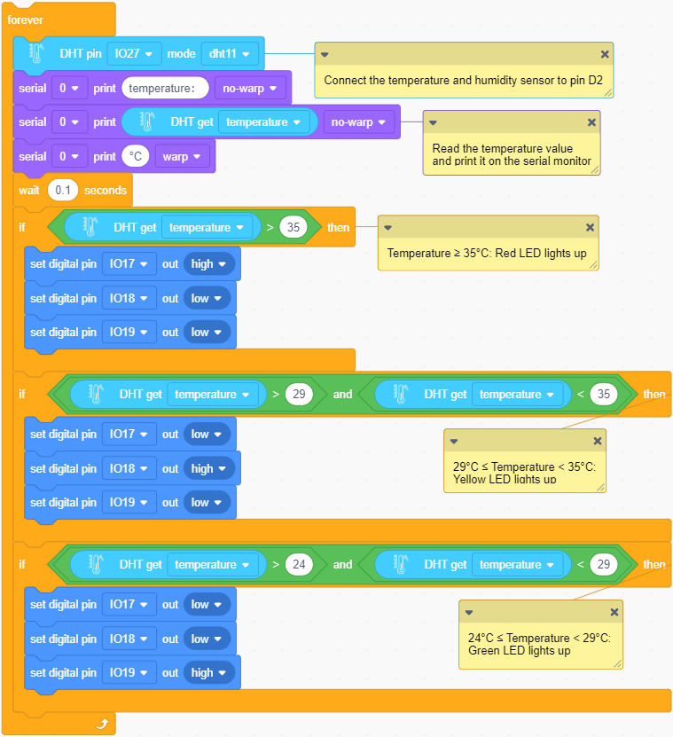

Test Result

After uploading the code, the XHT11 sensor detects the ambient temperature value.

When the value is in the preference temperature range, the green LED lights up;

When the value is within the warning temperature range, the yellow LED turns on;

When the value exceeds the high temperature threshold, the red LED lights up.

---

4.6 Ultraviolet Detection

In daily life, when the UV index is greater than 3, you'd better do sunscreen measures when going out. This station will calculate the UV index in real time to make timely reminders.

In this experiment, we detect the UV index with an ultraviolet sensor and a traffic light module. When the detected UV index is higher than a set threshold, the red LED will light up.

Flow

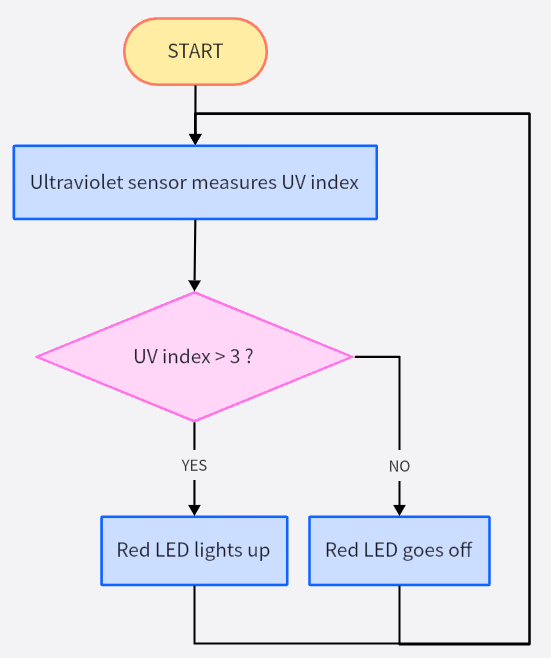

Assembly

**Required Parts**

**Step 1**

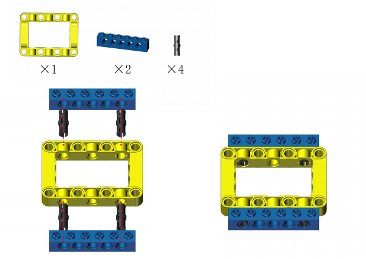

**Step 2**

**Step 3**

**Step 4**

**Step 5**

**Step 6**

**Step 7**

**Completed**

Wiring Diagram

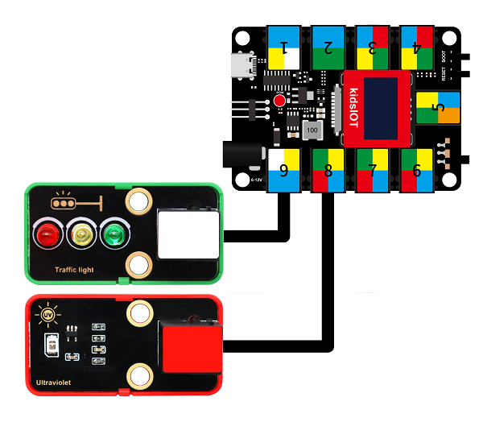

Test Code

Open KidsBlock and connect the board to your computer. Click **File --> Load from your computer**.

Choose D:\Code\2.Code_kidsIOT to open **4.6Ultraviolet detection.sb3** file.

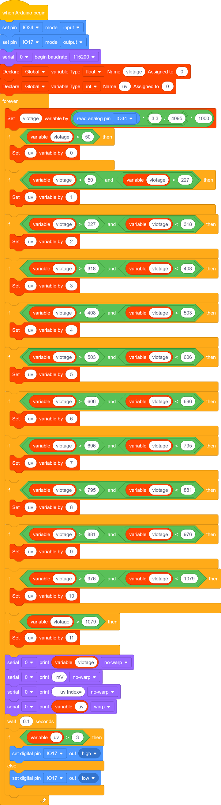

Click to connect to port and then .

Explanations

**Conceive:**

When the UV index is within 0 ~ 2, the ultraviolet light is the weakest, and it does not have much effect on the human body. When the index increases to 3 ~ 4, the ultraviolet light is weak, but remember to wear sunscreen when going out. 

Herein, we set the threshold of the UV index to 3. If the value exceeds 3, the red LED will light up to remind you to wear sunscreen. If the value does not reach 3, the LED will go off.

**Code structure:**

1. Initialization.

   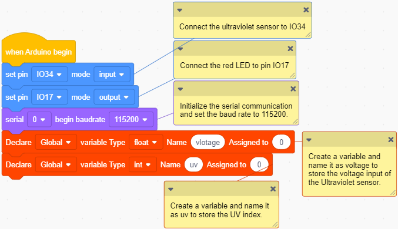

2. Loop:

   if elif statement to determine the range of UV index, and output the value.

   Determine whether the UV index exceeds 3.

   - UV index > 3: the red LED lights up as a reminder.
   - UV index ≤ 3: the red LED goes off.
   
   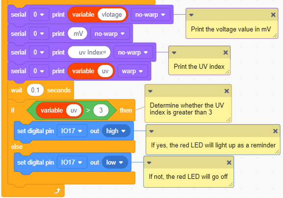

Test Result

After uploading the code, when the UV index is greater than 3, the red LED will light up to remind you to take sun protection measures when going out.

---
4.7 Air Pressure Detection

The station monitors air pressure in real time. When the air pressure is in normal range, the green LED lights up; When it is in the low range, the yellow LED turns on; When it is high, the red LED is on.

In this experiment, we use an LPS331APTR air pressure sensor and a traffic light module to reveal the air pressure. LED will light up in corresponding colors when the pressure value is in the related set range.

Flow

Assembly

**Required Parts**

**Step 1**

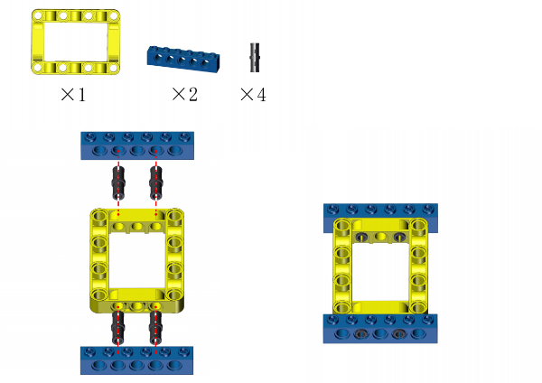

**Step 2**

**Step 3**

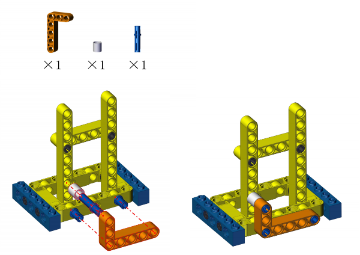

**Step 4**

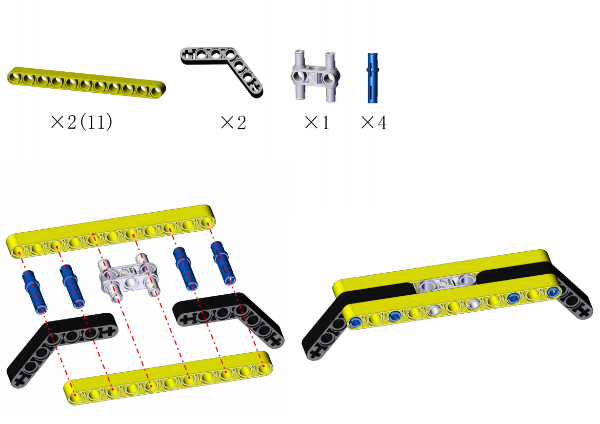

**Step 5**

**Step 6**

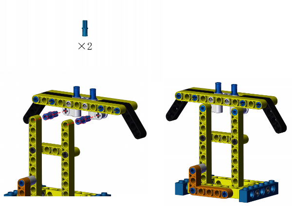

**Step 7**

**Step 8**

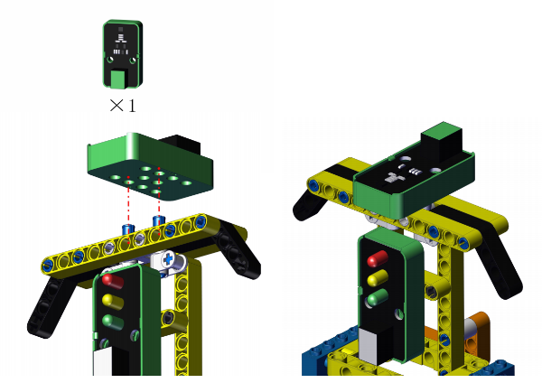

**Step 9**

**Completed**

Wiring Diagram

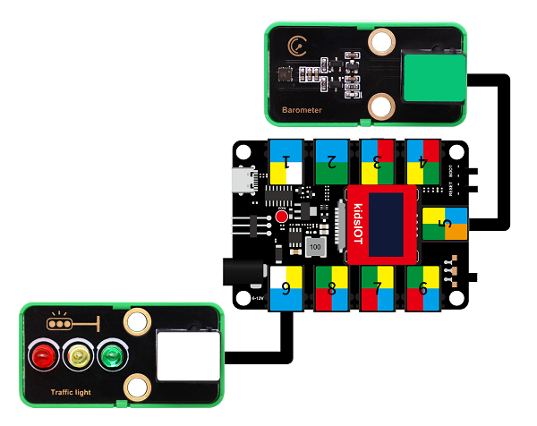

Test Code

Open KidsBlock and connect the board to your computer. Click **File --> Load from your computer**.

Choose D:\Code\2.Code_kidsIOT to open **4.7Air pressure detection.sb3** file.

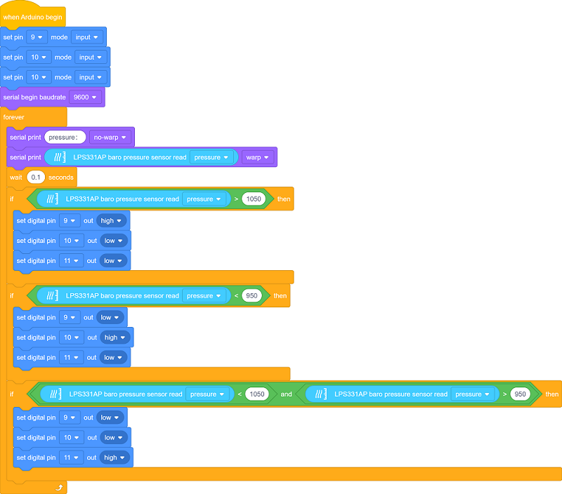

Click to connect to port and then .

Explanations

**Conceive:**

Generally, air pressure within 950hPa ~ 1050hPa is regared as the normal range. If the pressure is lower than 950hPa or higher than 1050hPa, human may have a headache or dizziness, and even some meteorological disasters will happen.

Set 950 and 1050 as two thresholds to divide the pressure into three ranges.

- low pressure: lower than 950hPa
- normal pressure: 950hPa ~ 1050hPa 
- high pressure: higher than 1050hPa

LED will light up in corresponding colors when the pressure value is in the related set range.

- Within low pressure range: the yellow LED lights up.
- Within normal pressure range: the green LED lights up.
- Within high pressure range: the red LED lights up.

**Code structure:**

1. Initialization. set the pins of LPS331APTR air pressure sensor and the traffic light module.

   

2. Loop.

   LPS331APTR sensor reads the air pressure value and outputs it.

   Determine which range of the pressure value is in, in order to turn of related LED.

   - air pressure > 1050hPa: the red LED lights up and other two LEDs goes off.
   - air pressure < 950hPa: the yellow LED lights up and other two LEDs goes off.
   - 950hPa < air pressure < 1050hPa: the green LED lights up and other two LEDs goes off.

   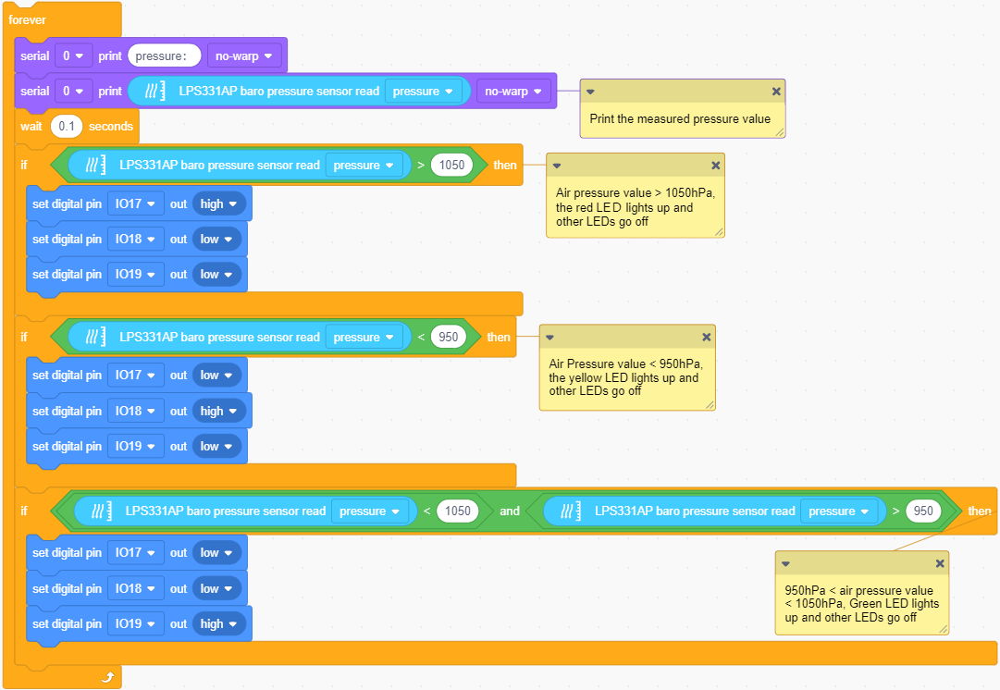

Test Result

After uploading the code, the LPS331APTR sensor measures the air pressure.

When the air pressure is in normal range, the green LED lights up;

When the air pressure is in the low range, the yellow LED lights up;

When the air pressure is in the high range, the res LED turns on.

---

