# Mini Meteorological Station for kidspico


## 1. Code and Firmware

[DOWNLOAD](../Code.zip)

Download and unzip these files. Here all codes are in folder **3.Code_kidspico** and firmware is at  **3.Firmware_kidspico**.

For convenience, <span style="color: rgb(2550, 10, 50);">we move the codes into: **D:\Code\3.Code_kidspico**.</span> You can also choose to move it into any disks at will. 

---


## 2. Development Environment Configuration

### 2.1 Thonny Download

#### Windows

**We demonstrate on Windows 10.**

Download: [Thonny Official](https://thonny.org)

Click **Windows** to choose one version to download.

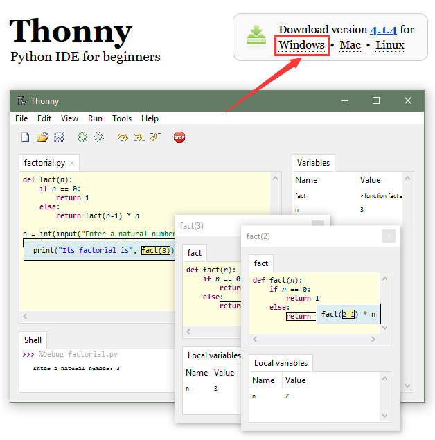


#### MAC

Similar to Windows.


### 2.2 Thonny Installation

Two methods:

- Install Thonny+Python package

	Recommended for beginners: When you install, the Python environment and Thonny will be packaged so both installed. There are also two ways to install the package:

	- Installer

		

	- Portable variant

		

- Install Thonny only

  Recommended for developers: When the user already has a python environment, `pip install thonny` comes in handy to install Thonny separately.

  

Please just install according to your needs.

#### Installer

Here we demonstrate how to install `Installer with 64-bit Python 3.10` on <span style="background:#ff0;color:#000">64bit Windows 10</span>.

(1）After downloading, click . And you will see **Select Setup Install Mode**, choose **Install for me only**.


(2） **Next** 


(3）Tick **I accept the agreement** and **Next**.

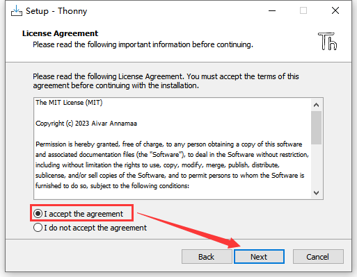

(4）The default path is Disk C, or you can click **Browse...** to modify the path. After that, click **Next**.


(5）Choose a path to create the program's shortcuts, and click **Next**.


(6）Tick **Create desktop icon** and click **Next**.


(7）Inatall 


(8）“**Finish**”


(9）Open Thonny and choose your language.


(10）Main interface:


#### Portable Variant

Here we demonstrate how to install `Portable variant with 64-bit Python 3.10` on <span style="background:#ff0;color:#000">64bit Windows 10</span>.

(1）After downloading and being unzipped, click  to choose your language.


(2）Main interface:


(3）For convenience, please send  to Desktop(create shortcut).


Shortcut: 

---

### 2.3 Firmware

Press and hold the BOOT button on the kidspico mainboard, connect it to PC via USB cable and then release the BOOT button. 

A removable hard disk will show up.

Open folder **3.Firmware_kidspico**, find and copy the firmware  into this disk.

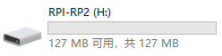

After that, open Thonny to connect to port (COM number varies from devices). 

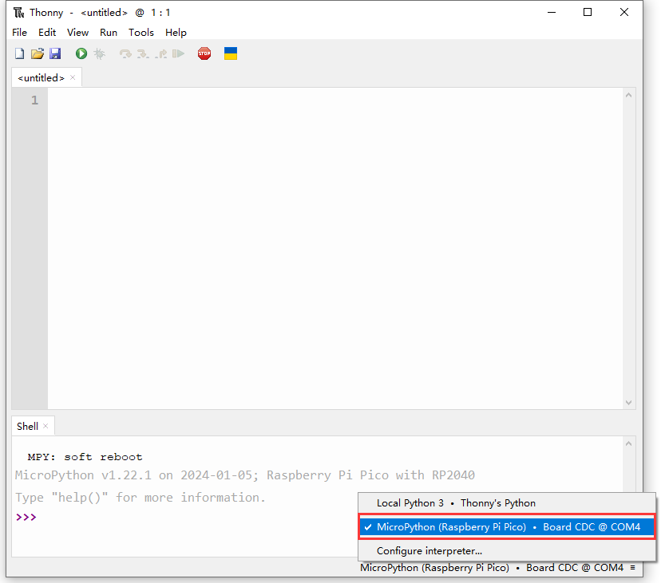

---

### 2.4 Thonny

#### Interface

Click **View** and tick **Files** to open the file path management.


#### Toolbar

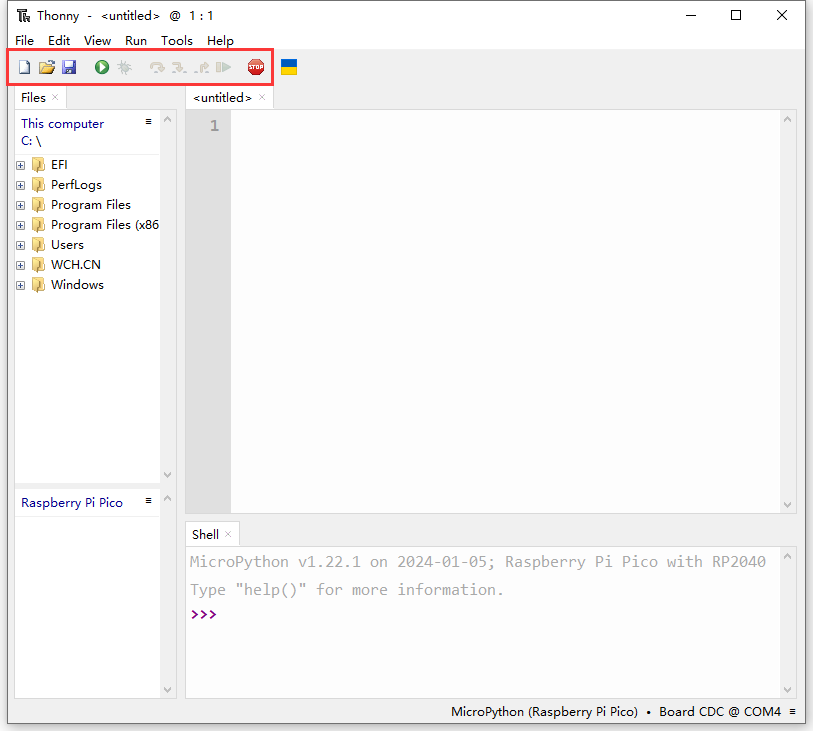

|          ICON           |            FUNCTION            |
| :---------------------: | :----------------------------: |
|  |          New (Ctrl+N)          |
|  |        Open... (Ctrl+O)        |
|  |         Save (Ctrl+S)          |
|  |    Run current script (F5)     |
|  |      Debug current script      |
|  |         Step over (F6)         |
|  |         Step into (F7)         |
|  |            Step out            |
|  |          Resume (F8)           |
|  | Stop/Restart backend (Ctrl+F2) |

---

### 2.5 Test

<span style="color: rgb(2550, 10, 50);">Please download and unzip code files and save them in a path as your need. For instance, **D:\Code\3.Code_kidspico**.</span>

In Files, click **This computer**.


Enter **Disk D** and open folder **Code**, find **3.Code_kidspico** and you will see all codes.

  

Connect to kidspico and choose COM port. 


#### Test Shell Command

Input the following code in Shell.	

```python
print('hello world')
```

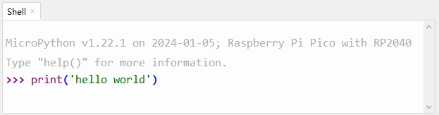

Press "Enter" and the Shell prints **hello world**.


---

#### Test Online Running

Click to open code **Onboard_LED.py**.


Click  to run the code, and the yellow LED on kidspico board will flashes: on for 1s and off for 1s.


---

#### Test Offline Running

Open **Onboard_LED.py** in Files: File --> Save as... 

Click  to create a new script, copy and paste Onboard_LED.py in it.


Click  to save it to Raspberry Pi Pico.


We name it as **main.py**.


After saving, the main.py code will automatically execute as long as the kidspico board is powered on. You will see the yellow LED flashes per second. 


---

## 3. Modules

<span style="color: rgb(2550, 10, 50);">Please move the codes to a convenient path as your needs, for instance, path: **D:\Code\3.Code_kidspico**.</span>

### Kidspico Ports View

During experiments, <span style="color: rgb(2550, 10, 50);">modules can only be connected to ports in the same color.</span>


### 3.1 White LED Module


**LED (Light-Emitting Diode)**

LED is a commonly used light emitting device that converts electrical energy into light energy. Usually, it is used as an indicator in circuits and instruments, or as part of texts or numeric display.

It generally includes gallium(Ga), arsenic(As), phosphorus(P), nitrogen(N) and so on. 

|     LED components      | Emitting light colors |
| :---------------------: | :-------------------: |
| gallium arsenide diode  |          red          |
| gallium phosphide diode |         green         |
|  silicon carbide diode  |        yellow         |
|  gallium nitride diode  |         blue          |


#### Parameters


Operating voltage: DC 3.3 ~ 5 V

Operating current: 1.5 mA (Peak: 2.3mA)

Maximum power: 0.07 W

Control signal: digital signal

Dimensions: 24 x 48 x 18 mm (without housing)

Positioning holes: diameter of 4.8 mm

Interface: telephone socket


#### Principle


Modules with blue housing are digital ones, so we should connect to digital io pins of the mainboard (ports with blue).


In this experiment, we connect the white LED module to port 1. According to the board ports view, the digital io pin at port 1 is io11.

When we set the pin to high(1), the LED lights up in white; if we set to low(0), it will be off.


#### Wiring Diagram


#### Test Code

Open Thonny and connect to COM port. Open **3.1Light_on.py** in **Files** and click .

```python
'''
 * Filename    : Light_on
 * Thonny      : Thonny 4.1.4
 * Auther      : http//www.keyestudio.com
'''
from machine import Pin
import time

led = Pin(11, Pin.OUT)  # Set an led object and connect it to pin 11, set pin to output
while True:
    led.on()       # led on
    time.sleep(1)  # delay 1s
    led.off()      # led off
    time.sleep(1)  # delay 1s
```

#### Explanations


1. `from machine import Pin`

   Import Pin from machine to enable its functions.


  **machine.pin**

```python
machine.Pin(id,mode,pull,value)
```

   - id ：GPIO number, within 0-29. For example, if you enable GPIO11, fill in with 11.

   - mode ：pin mode can be one of the followings:

	​	Pin.IN(0) - set pin to input

	​	Pin.OUT(1) - set pin to (normal)output

	​	Pin.OPEN_DRAIN(2) - set pin to open drain output

   - pull ：specifies whether the pin is connected to a (weak-)pull resistor; it is valid only at input mode, and can be one of the followings:

	​	None - no pull-up/down

	​	Pin.PULL_UP(1) - enable pull-up resistor

	​	Pin.PULL_DOWN(2) - enable pull-down resistor

   - value ：only work at Pin.OUT and Pin.OPEN_DRAIN mode; assign the initial output pin value. Or else, the peripheral state of the pin stays still. 0 is low(off) while 1 is high(on).

   - Pin.on() - set pin to high

   - Pin.off() - set pin to low


2. `import time`

   Import **time** type so that its related functions can be adopted.


3. `led = Pin(11, Pin.OUT)`

	Set LED pin io11 to output mode.


Q ：Why "output"?

A ：The code is written for the mainboard. For the board, pin io11 is outputting power levels (high or low) to the connected module.


4. `while True:`

   Statements in this function will execute in a loop.

   Formula of while loop function:

```python
while (condition):
    (statements)
```


5. `led.on()` and `led.off()`

   At pin io11 on the mainboard, respectively output high(1) and low(0); i.e., output high(1)/low(0) to LED module to make it on/off.


6. `time.sleep(1)` 

   Delay 1s.

   

   Q ：Why delay?

   A ：If you output a high level to LED, it will be always on. Yet, we add a delay of 1s, so it lights up for only 1s. Delay time is the ON/OFF time of LED.
   
   


#### Test Result


After uploading code, the LED module will flash with an interval of 1s (on for 1s and off for 1s).


Click  or Ctrl+C to exit the execution.


---

### 3.2 Hall Magnetic Sensor


This Hall sensor module is mainly composed of A3144 linear Hall components. 

Based on Hall Effect, its magnetic sensitive circuit adopts semiconductor integration technology, which is a magnetic sensing circuit composed of a voltage regulator, a Hall voltage generator, a differential amplifier, a Schmidt trigger temperature compensation circuit and an open-collector output stage. 

Its input is the magnetic induction intensity and its output is a digital voltage signal.


#### Parameters


Voltage: DC 3.3 ~ 5V 

Current: 10 mA

Maximum power: 0.05 W

Operating temperature: -10°C ~ +50°C

Dimensions: 32 x 24 x 18 mm（without housing）

Positioning hole: diameter of 4.8mm

Interface: Telephone socket


#### Principle


This Hall sensor is able to distinguish magnetic field north and south. The front of the magnetic induction element (with numbers) senses the South Pole, while its back detects the North Pole.


Modules with blue housing are digital ones, so we should connect to digital io pins of the mainboard (ports with blue).


In this experiment, we connect the Hall sensor module to port 2. According to the board ports view, the digital io pin at port 2 is io8.

When a magnetic field is detected, Hall sensor outputs low; When no magnetic field is detected, the sensor outputs high.


#### Wiring Diagram


#### Test Code

Open **3.2Hall sensor.py** and click .

```python
'''
 * Filename    : Hall sensor
 * Thonny      : Thonny 4.1.4
 * Auther      : http//www.keyestudio.com
'''
from machine import Pin
import time

hall = Pin(8, Pin.IN)
while True:
    value = hall.value()
    print(value, end=' ')
    if value == 0:
        print("A magnetic field")
    else:
        print("There is no magnetic field")
    time.sleep(0.1)
```

#### Code Explanation


1. `hall = Pin(8, Pin.IN)`

   Connect Hall sensor to pin io8 and set it to input mode.


2. `value = hall.value()` 
   
   Assign the power level output by the sensor to  `value`.


3. `print(value, end=' ')` 
   
   Print value without wrapping, and end with space.
   
   
   
   `print()`  will wrap to output results **by default**, because there is a **line break** `end ='\n'` which is usually omitted.
   
   In this code, we add `end=''` which will output a space at the end, so the default line break will be canceled. By doing this, the contents will be output without wrapping. 
   
   `end=' '`: add a space at the end rather than a line break.
   
   
   
   Q ：Why Space?
   
   The value will be too close to the contents, which is not convenient for us to check the outputs.
   
   Without space (`end=''`):
   
   
   
   With space (`end=' '`):
   
   
   
   A ：We add a space to separate the value and contents.
   
   
   
   


4. ```python
   if value == 0:
       print("A magnetic field")
   else:
       print("There is no magnetic field")
   ```

   **if statement**

   value = 0 (return True): Shell prints *A magnetic field*

   value ≠ 0 (return False): Shell prints *There is no magnetic field*

   

   The process flow of if statement:

   

   Running Principle: pose a condition to determine the trend of next step. If the condition is true, execute the code under this condition. If false, exit the execution.

   In Python, any non-zero/non-empty object is true, and everything else except true and None is false.
   
   - any non-zero/non-empty object is True
   - number 0, empty object and None are False
   - outputs are only True or False.

   Basic composition of an **if statement**:
   
   ```python
   if condition_1:
       statement_block_1
   else:
       statement_block_2
   ```

   If "condition_1" is True, execute "statement_block_1".

   If "condition_1" is False, skip "statement_block_1" to run "statement_block_2".

   Basic composition of an **if elif statement**:
   
   ```python
   if condition_1:
       statement_block_1
   elif condition_2:
       statement_block_2
   else:
       statement_block_3
   ```

   If "condition_1" is True, execute "statement_block_1" .

   If "condition_1" is False, skip "statement_block_1" to determine "condition_2".

   If "condition_2" is True, execute "statement_block_2" .
   
   If "condition_2" is False, skip "statement_block_2" to run "statement_block_3".


5. `time.sleep(0.1)`

   Delay 0.1s to stabilize the output, otherwise the Shell will print results at a very fast speed.


#### Test Result


After uploading the code, when the **South Pole** of the magnet approaches to the front of the magnetic induction element, the red LED lights up and Shell prints *0  A magnetic field*; 

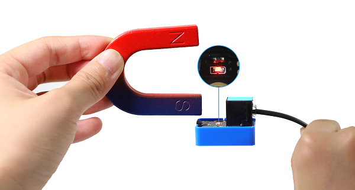

When the **South Pole** of the magnet approaches to its back or is away from the sensor, the red LED goes off, and Shell prints *1  There is no magnetic field* .


Put the **North Pole** of the magnet to the back of the element, the red LED lights up and Shell prints *0  A magnetic field*; 


Put the **North Pole** of the magnet approach to the sensor or is away from its back, the red LED goes off, and Shell prints *1  There is no magnetic field*.


Click or click Ctrl+C to exit execution.


---

### 3.3 Passive Buzzer


Buzzer is an integrated structure of electronic sound device, which is powered by DC voltage. In application, it is widely used in computers, printers, copiers, alarms, electronic toys, automotive electronic equipment, telephones and timers. 

Buzzers can be divided into active ones(built-in drive circuits) and passive ones(external drive) according to that whether they includes an excitation source.

Active buzzers contain oscillation source inside, which can sound at a fixed frequency once be triggered. They are convenient in program control and features high sound pressure.

Passive ones, however, do not include oscillating sources. If we directly power a passive buzzer via DC voltage, it will emit no sound. According to needs, we generally drive through square waves, whose frequency determines the sound tones.

**To sum up, The active buzzer contains a vibration source, and its sound frequency is fixed. Yet there is no vibration source inside the passive one, so it must be driven by square waves whose frequency can be changed to control sounds.**


#### Parameters


Operating voltage: DC 3.3 ~ 5V 

Operating temperature: -10°C ~ +50°C

Control signal: Digital signal

Dimensions: 48 x 24 x 18 mm（without housing）

Positioning hole: diameter of 4.8mm

Interface: Telephone socket


#### Principle


Music is an invisible art. It is a language that narrates emotions and thoughts. 

The foundation of music, as we all know, is note. We can compose a variety of melodies and rhythms with different notes. Of all the notes, the most basic are seven:


We can compose a variety of melodies and rhythms with these notes.

Passive buzzer module must be drive by square waves to emit sound. We can change the duty cycle of PWM to control square waves.

- The greater the duty cycle is, the lauder the sound will be.

And the tones vary from different frequency of PWM.

- The higher the frequency is, the higher the tone will be.


**What is PWM?**

PWM (Pulse width modulation) simulates the change of analog signal through digital signal.

Pulse width is the high level in a complete square wave cycle. So, pulse width modulation is to adjust the high level(of course, in other words, low level is also adjusted).


- **PWM frequency**: the number of times the signal going from high level to low level and back to high level in 1 second (one cycle), that is, how many cycles there are in a second.

  **Unit**: Hz

  **Expression**: 50Hz 100Hz

- **PWM cycle**

  $ T= \frac {1}{f}$      $ cycle = \frac {1}{frequency}$

  If the frequency is 50Hz, the cycle will be 20ms, i.e., there are 50 PWM cycles in one second.

- **PWM duty cycle**: the ratio of high level time to the whole cycle time.

  - Unit: %(1% ~ 100%)

  
  - Cycle: The time of a pulse signal. The number of cycles in 1s equals the frequency.
  - Pulse width time: high level time.
  
  

  <center>The relationship between duty cycle and LED brightness.gif<center>

  The longer the high level time is, the greater the duty cycle will be, and the brighter the LED will be.


**The PWM frequency corresponding to notes**:


Modules with blue housing are digital ones, so we should connect to digital io pins of the mainboard (ports with blue).


In this experiment, we connect the passive buzzer to port 3. According to the board ports view, the digital io pin at port 3 is io3.


#### Wiring Diagram


#### Test Code

Open **3.3Passive buzzer.py** and click .

```python
'''
 * Filename    : Passive buzzer
 * Thonny      : Thonny 4.1.4
 * Auther      : http//www.keyestudio.com
'''
from machine import Pin, PWM
import time

buzzer = PWM(Pin(3))

'''
-----------------------------
| Pitch names |  Frequency  |
|---------------------------|
|      C      |     523     |
|      D      |     587     |
|      E      |     659     |
|      F      |     698     |
|      G      |     784     |
|      A      |     880     |
|      B      |     988     |
-----------------------------
'''
a = [523,587,659,698,784,880,988]

while True:
    #Tone of duty cycle = 1000
    for i in a:
        buzzer.duty_u16(1000)
        buzzer.freq(i)
        time.sleep(0.2)
    #Tone of duty cycle = 5000
    for i in a:
        buzzer.duty_u16(5000)
        buzzer.freq(i)
        time.sleep(0.2)
```

#### Code Explanation


1. `from machine import Pin, PWM`

   Import PWM function.
   
   
   
    **machine.PWM**
   
      - `machine.PWM(pin)`: PWM object function, set the specified GPIO to re-initialize and set the mode of PWM output. 
   
        pin: is the GPIO object whose PWM output needs to be set.
   
      - `PWM.freq（value）`: set the PWM output frequency. 
   
        value: PWM output frequency. The value should conform to the PWM frequency calculation formula.
   
      - `PWM.duty_u16（value）`: set duty cycle. Corresponding values will be automatically calculated.
   
        value: Set duty cycle ratio within 0-65536.


2. `buzzer = PWM(Pin(3))` 

   Connect the passive buzzer to pin io3, output PWM.


3. `a = [523,587,659,698,784,880,988]`

   Create a list **a** and put elements in [ ], including 523, 587, 659, 698,7 84, 880, 988, which are correspond to frequency of C, D, E, F, G, A, B.


4. ```python
   #Tone of duty cycle = 1000
   for i in a:
   	buzzer.duty_u16(1000)
       buzzer.freq(i)
       time.sleep(0.2)
   ```

   **for loop**: play tones when the duty cycle is 1000, each tone is played for 0.2 seconds.

   

   In Python, a for loop is an traversal flow that can be used to process every element(string, list, tuple, dictionary, set) in sequence, or to execute a loop for a specified number of times. 

   Here is the syntax of a for loop:
   
   ```python
   for iterating_var in sequence:
      statements(s)
   ```

   The process flow of for loop:

   

   Process strings:
   
   ```python
   # Define string name
   hopy = "reaipaobu"
   # Process the string in for loop
   for x in hopy: 
          print(x)
   ```

   Results:
   
   ```
   r
   e
   a
   i
   p
   a
   o
   b
   u
   ```
   
   In for loop, characters in the string will be output separately, so it is also called traversal loop function.


5. ```python
   #Tone of duty cycle = 5000
   for i in a:
       buzzer.duty_u16(5000)
       buzzer.freq(i)
       time.sleep(0.2)
   ```

   Similarly, this for loop play tones when the duty cycle is 5000, each tone is played for 0.2 seconds.


#### Test Result


After uploading the code, the buzzer will circularly play tones(C, D ,E, F, G, A, B) of duty cycle of 1000 and 5000. It is obvious that the sound is much louder when the duty cycle is 5000.

Click or click Ctrl+C to exit execution.


#### Extension


Congratulations! You have played these basic notes successfully! Now let's try to compose a beautiful music and play with this passive buzzer!

Open **3.3Music.py**.

Import library to kidspico before uploading code. Open **buzzer_music.py** and choose *Upload to /*.


Upload successfully.


Click  to run the code. Cool! do you hear the music?


---

### 3.4 XHT11 Temperature and Humidity Sensor


XHT11 sensor is a low-cost and entry-level temperature and humidity sensor, which consists of a resistive humidity sensor and an NTC temperature sensor. It is designed 4-pin single-row pin and adopts single-wire serial interface, so we just add the appropriate pull-up resistance to read values. Moreover, its signal transmission distance can reach more than 20 meters.


#### Parameters


Operating voltage ：DC 3.3 ~ 5V 

Operating current: 2.1 mA

Maximum power: 0.015 W

Humidity detection range: 5 ~ 95%RH (accuracy of ±5%RH under 25°C)

Temperature detection range: -25°C ~ +60°C

Operating temperature: -10°C ~ +50°C

Input signal: Digital signal

Dimensions: 48 x 24 x 18 mm (without housing)

Positioning hole: diameter of 4.8mm

Interface: Telephone socket


#### Principle


Modules with blue housing are digital ones, so we should connect to digital io pins of the mainboard (ports with blue).


In this experiment, we connect the sensor to port 4. According to the board ports view, the digital io pin at port 4 is io2.


#### Wiring Diagram


#### Test Code

Open **3.4Humiture.py** and click .

```python
'''
 * Filename    : Humiture
 * Thonny      : Thonny 4.1.4
 * Auther      : http//www.keyestudio.com
'''
from machine import Pin
import time
import dht

#Connect XHT11 sensor to pin (2)
XHT = dht.DHT11(Pin(2))

# Attain and print temperature and humidity value per seconds
while True:
    XHT.measure() # XHT11 measures a value
   # Call dht built-in function to acquire temperature and humidity values and Shell prints them
    print('temperature:',XHT.temperature(),'℃','humidity:',XHT.humidity(),'%')
    time.sleep(0.5)
```

#### Code Explanation


1. `import dht`

   Import dht library to enable functions in it.


2. `XHT = dht.DHT11(Pin(2))` 

   Connect XHT11 temperature and humidity sensor to pin io2.


3. `XHT.measure()`
   
   Call the measure function to detect the temperature and humidity value once.


4. `XHT.temperature()` and `XHT.humidity()`

   Call the attain function to acquire the temperature and humidity values, and then return them.


5. `print('temperature:',XHT.temperature(),'℃','humidity:',XHT.humidity(),'%')`

   `print()` prints multiple values with a line break.

   The contents to be printed should be enclosed in single quotation marks.

   

   And these contents must be separated with commas.

   


6. `time.sleep(0.5)`

   Add a delay of 0.5s to refresh the values every 0.5s.


#### Test Result


Before uploading code, please connect wires well. Otherwise, errors will occur:


After uploading the code, Shell prints the temperature and humidity values every 0.5s.


Blow to the XHT11 sensor and you will see both temperature and humidity values rise.


Click or click Ctrl+C to exit execution.


---

### 3.5 Steam Sensor


Unlike the previous modules, the steam sensor is an analog module rather than a digital one.

What is the difference? For digital modules, they only output high(3.3V) or low(0V); while analog ones are able to output or input intermediate voltage values through ADC analog ports on the board.


#### Parameters


Operating voltage: DC 3.3 ~ 5V 

Operating current: 1.5 mA

Maximum power: 0.075 W

Operating temperature: -10°C ~ +50°C

Dimensions: 48 x 24 x 18 mm (without housing)

Positioning hole: diameter of 4.8mm

Interface: Telephone socket


#### Principle


The steam sensor measures the amount of water through its exposed lines. The water will connect these lines. The more amount of water is, the wider the conductive area will be connected, and the higher the output voltage will be.

With the change of amount of water, the voltage (0 ~ 3.3V) detected by the analog port will change accordingly. This change is continuous, which means it can be any value within 0 ~ 3.3V.

<span style="color: rgb(10, 10, 200);">The board can only process digital signals, so we need to convert analog signals in to digital ones. Thus, an ADC(Analog to Digital Converter) acquisition is required.</span>


**What is ADC?**

ADC(Analog to Digital Converter) converts analog values to digital ones. The ADC acquisition is integrated in our board, so you can call it directly. 

**Kidspico ADC Parameters**

1. Reference voltage: 3.3V

1. Resolution: 12bit

   A n-bit ADC means this ADC contains 2ⁿ scales.

   12-bit ADC contains $2^{12}=4096$ scales, and it outputs totally 4096 digital values (including from 0～ 4095), each scale is $\frac{3.3}{4095}≈0.00081(V)$ 

2. General ADC input voltage calculation: 

   <font face="courier New" color="black" size=6>$ Vin= \frac {AVDD_{ADC}}{2^{Resolution Bit}-1}*ReadData$</font> 

   $AVDD_{ADC}$: Reference voltage

3. ADC channel: 5 channels

   ADC0 - ADC3 are GPIO26 - 29, among which ADC0, ADC1, ADC2 are available to commonly measure the analog voltage, while ADC3 detects on-board VSYS voltage.

   Since ADC4 is built-in, it cannot be used at the pin. It measures the value of the on-board temperature sensor.	


Modules with red housing are analog ones, so we should connect to analog io pins of the mainboard (ports with red).


In this experiment, we connect the module to port 6. According to the board ports view, the analog io pin at port 6 is io28.

In addition to the measurement of water amount, this module also detects the vapor in air.


#### Wiring Diagram


#### Test Code

Open **3.5Steam sensor.py** and click .

```python
'''
 * Filename    : Steam sensor
 * Thonny      : Thonny 4.1.4
 * Auther      : http//www.keyestudio.com
'''
from machine import ADC  # Import ADC module
import time

# Configure ADC, range of 0-3.3V
# define io26,io27,io28,io29 to ADC channel 0,1,2,3
Water = ADC(28)  #Photores = ADC(2)
conversion_fator = 3.3 / 65535  #Voltage value of a single scale

# Read analog value every 0.1s and convert the analog value into voltage output
while True:
    Water_value = Water.read_u16()
    voltage = Water_value * conversion_fator
    print('ADC Value:',Water_value,'   Voltage:',voltage,'V')
    time.sleep(0.1)
```

#### Code Explanation


1. `from machine import ADC`

   Import ADC module
   
   
   
   **machine.ADC function**
   
   - `machine.ADC(id)`	: ADC object constructor initializes the corresponding ADC channel.
   
     id: GPIO (PIN) object (GPIO26 ~ 29) or ADC channel (0 ~ 3)
   
   - `ADC.read_u16() `	: read corresponding ADC value and return the read value.
   
     ATTENTION: <span style="color: rgb(10, 10, 200);">In MicroPython, the ADC is converted to 16-bit for calculation, that is, from 0 to 65535. This function does not directly return the value read by ADC, but the processed one, which ranges from 0 to 65535.</span>
   
     ADC voltage calculation: <font face="courier New" color="black" size=6>$ Vin= \frac {3.3*ReadData}{65535}$</font>


2. `Water = ADC(28)` 

   Define ADC2 to receive the analog value of the steam sensor.

   ADC0 - ADC3 are GPIO 26 - 29, among which ADC0, ADC1, ADC2 are available.


3. `conversion_fator = 3.3 / 65535` 
   
   Voltage value of a single scale


4. `Water_value = Water.read_u16()`

   Read the ADC2 value of corresponding channel, and return the read value.

   `read()` reads digital inputs, while `read_u16()` reads analog inputs. `u16` indicates that the result received is not a binary (0 or 1), but an unsigned 16-bit integer (0 ~ 65535).


5. `voltage = Water_value * conversion_fator`

   Convert values into voltage value. The voltage value (unit: V) equals analog value multiply by the voltage value of a single scale.


#### Test Result


After uploading the code, Shell outputs the detected analog values of water/vapor and the converted voltage values.


The more the amount of water is / the wetter the air is, the greater the analog and voltage value will be.


Breath on the detection area, or touch it with a wet tissue, and you will see the analog value ans voltage will both increase.

<span style="color: rgb(2550, 10, 50);">**ATTENTION: Be careful when using water, please do not to drip to any other place outside the detection area to aviod a short circuit.**</span>


Click or click Ctrl+C to exit execution.


---

###  3.6 Flame Sensor


Since a far-infrared flame probe is reserved, the flame sensor is particularly sensitive to the flame spectrum, so this sensor is an essential part of the fire-fighting robot to find the fire source.


#### Parameters


Operating voltage: DC 3.3 ~ 5V 

Current: 1.2 mA

Maximum power: 0.006 W

Detection flame wavelength: 760 nm ~ 1100 nm

Detection range: 0 ~ 60 mm

Detection Angle: about 60°

Operating temperature: -10°C ~ +50°C

Dimensions: 48 x 24 x 18 mm

Positioning hole: diameter of 4.8mm

Interface: Telephone socket


#### Principle


The sensitive element of the sensor is a special infrared receiving diode, which is very sensitive to the infrared generated by the flame. It detects flame by converting the brightness of the flame into power level signals.

Modules with red housing are analog ones, so we should connect to analog io pins of the mainboard (ports with red).


In this experiment, we connect the module to port 6. According to the board ports view, the analog io pin at port 6 is io28.


#### Wiring Diagram


#### Test Code

Open **3.6Flame sensor.py** and click .

```python
'''
 * Filename    : Flame sensor
 * Thonny      : Thonny 4.1.4
 * Auther      : http//www.keyestudio.com
'''
from machine import ADC  # Import ADC module
import time

# Configure ADC, range of 0-3.3V
# Define io26,io27,io28,io29 to ADC channel 0,1,2,3
Flame = ADC(28)  #Photores = ADC(2)
conversion_fator = 3.3 / 65535  #Voltage value of a single scale

# Read analog value every 0.1s and convert the analog value into voltage output
while True:
    Flame_value = Flame.read_u16()
    voltage = Flame_value * conversion_fator
    print('ADC Value:',Flame_value,'   Voltage:',voltage,'V',end ='   ')
    if voltage < 2:
        print('Flame detected!')
    else:
        print(end ='\n')
    time.sleep(0.1)
```

#### Code Explanation


The first half part is exactly the same as the previous project. In the last half, we adopt an if statement. 

Print the analog value detected by the flame sensor and the converted voltage.

When flame is detected, the voltage decrease. The brighter the flame is, the lower the voltage will be output. 

In this experiment, we set the threshold voltage value to 2 (you can modify this value according to needs), so when the voltage is lower than 2, the flame is detected.

Add an if statement to determine whether the voltage output is lower than 2.

```python
if voltage < 2:
	print('Flame detected!')
else:
    print(end ='\n')
```

If voltage < 2, Shell will display *Flame detected!* ; When voltage ≥ 2, Shell will prints values in the next line, because a line break command `end ='\n'`  is used in the code.


#### Test Result


After uploading the code, *Flame detected!* will be displayed on the Shell when the flame sensor detects flame.


Click or click Ctrl+C to exit execution.


---

### 3.7 Sound Sensor


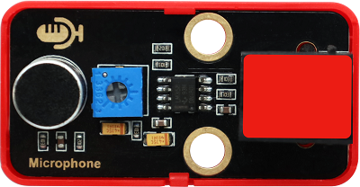

The sound sensor acts as a microphone that can capture sound information in the environment.

It is consists of a sensitive capacitor microphone for detecting sound and an amplification circuit. It works based on the propagation and vibration of sound. When sound travels near the sensor, the sound wave causes the sensor to vibrate. Then, the sensor converts sound vibrations into electrical signals and sends them for further processing or analysis.


#### Parameters


Operating voltage: DC 3.3 ~ 5V 

Current: 15 mA

Maximum power: 0.075 W

Operating temperature: -10°C ~ +50°C

Dimensions: 48 x 24 x 18 mm

Positioning hole: diameter of 4.8mm

Interface: Telephone socket


#### Principle


When you speak loudly or play music to the MIC, these sound signals are converted into electrical ones, which are output at analog ports.

The amplifier circuit on the module amplifies the sound detected by the MIC. We can adjust the amplification by rotating the potentiometer. It is the maximum when we adjust the potentiometer clockwise to the end.


Modules with red housing are analog ones, so we should connect to analog io pins of the mainboard (ports with red).


In this experiment, we connect the module to port 7. According to the board ports view, the analog io pin at port 7 is io27.


#### Wiring Diagram


#### Test Code

Open **3.7Sound sensor.py** and click .

```python
'''
 * Filename    : Sound sensor
 * Thonny      : Thonny 4.1.4
 * Auther      : http//www.keyestudio.com
'''
from machine import ADC
import time

# Configure ADC, range of 0-3.3V
# Define io26,io27,io28,io29 to channel 0,1,2,3
MicroPhone = machine.ADC(27)  #MicroPhone = ADC(1)
while True:
    Micro_value = MicroPhone.read_u16()
    print(Micro_value)
    time.sleep(0.1)
```

#### Code Explanation


**Conceive:**

1. Initialization. Import ADC and time module, set the pin of the sound sensor.

2. Loop.

   Read the ADC value of corresponding channel and print the value on Shell, refresh the results every 0.1s.


#### Test Result


After uploading the code, speak to the MIC, and Shell will display the analog value of sound volume that is detected by the sound sensor.


Click or click Ctrl+C to exit execution.


---

### 3.8 Ultraviolet Sensor


In the solar spectrum, the frequency of ultraviolet is higher than that of visible light, so it is invisible. 

Ultraviolet light can be divided into UVA, UVB, UVC, EUV. Among them, UVA causes tanning; UVB may burn skin due to its shorter wavelength; UVC is normally blocked by the ozone layer. 

Through ultraviolet radiation, the skin will produce more melanin, which is distributed upward into the cuticle of the epidermis to form brown spots. So it is the biggest culprit of skin wrinkles, aging or sagging.

But it's not all bad. When ultraviolet light hits the body, it can promote the synthesis of vitamin D to prevent rickets. Besides, it harbors bactericidal efficacy, so some hospitals disinfect by ultraviolet light. In spite of its benefits, too strong ultraviolet will harm the human body, leading to a skin cancer.


#### Parameters


Operating voltage: DC 3.3 ~ 5V 

Operating current: 1 mA

Operating power: 0.005 W

Peak wavelength: 355 nm

Peak response rate: 0.18A/W (at 355 nm)

Spectral response range: 280 ~ 370 nm

Active region: 0.076 mm²

Responsivity: 0.14 A/W (test under λ = 300 nm, U~R~ = 0 V)

Dark current: 1nA (test under U~R~ = 0.1 V )

Light current: 113 nA (test under UVA light, 1 mW/cm); 26 nA (test under 1 UVI)

Temperature coefficient: 0.08 %/°C 

Operating temperature: -10°C ~ +50°C

Output signal: Analog signal

Dimensions: 48 x 24 x 18 mm (without housing）

Positioning hole: diameter of 4.8mm

Interface: Telephone socket


#### Principle


This ultraviolet sensor measures the intensity of ultraviolet light and converts it into electrical outputs.

The relationship between the output voltage of the UV sensor and the UV index:


<center>Comparison Table of Voltage and UV index</center>

We can have a clearly look of the UV index corresponding to the output voltage. <span style="color: rgb(10, 10, 200);">The voltage is in the unit of mV.</span>

Modules with red housing are analog ones, so we should connect to analog io pins of the mainboard (ports with red).


In this experiment, we connect the module to port 8. According to the board ports view, the analog io pin at port 8 is io26.


#### Wiring Diagram


#### Test Code

Open **3.8Solar ultraviolet sensor.py** and click .

```python
'''
 * Filename    : Solar ultraviolet sensor
 * Thonny      : Thonny 4.1.4
 * Auther      : http//www.keyestudio.com
'''
from machine import ADC
import time

# Configure ADC, range of 0-3.3V
# Define io26,io27,io28,io29 to ADC channel 0,1,2,3
ultraviolet = ADC(26)  #ultraviolet = ADC(0)
conversion_fator = 3.3 / 65535  #Voltage value of a single scale

while True:
    ultraviolet_value = ultraviolet.read_u16()
    voltage = int(ultraviolet_value * conversion_fator * 1000)  #Convert unit into mV
    print(voltage,'mV',end = '     ')
    # voltage < 50
    if voltage < 50:
        uv = 0
    # 50 < voltage < 227
    elif voltage < 227:
        uv = 1
    # 227 < voltage < 318
    elif voltage < 318:
        uv = 2
    # 318 < voltage < 408
    elif voltage < 408:
        uv = 3
    # 408 < voltage < 503
    elif voltage < 503:
        uv = 4
    # 503 < voltage < 606
    elif voltage < 606:
        uv = 5
    # 606 < voltage < 696
    elif voltage < 696:
        uv = 6
    # 696 < voltage < 795
    elif voltage < 795:
        uv = 7
    # 795 < voltage < 881
    elif voltage < 881:
        uv = 8
    # 881 < voltage < 976
    elif voltage < 976:
        uv = 9
    # 976 < voltage < 1079
    elif voltage < 1079:
        uv = 10
    # 1079 > voltage
    else:
        uv = 11
    time.sleep(0.1)
    print('UV Index = ',uv)
```

#### Code Explanation


**Conceive:**

1. Initialization. Import ADC and time module. Connect ultraviolet sensor to pin io26 to occupy ADC channel 0.

2. Loop.

   ① Read the value of ADC0.

   ② The voltage unit in the Comparison Table is millivolt(mV), so we convert the analog value read by the sensor into voltage in mV.

   ③ **if elif** statement: set the range of UV index according to the Comparison Table.

   |    Voltage (mV)     |   UV index    |
   | :-----------------: | :-----------: |
   |   lower than 50mV   | UV index = 0  |
   |    50mV ~ 227mV     | UV index = 1  |
   |    227mV ~ 318mV    | UV index = 2  |
   |    318mV ~ 408mV    | UV index = 3  |
   |    408mV ~ 503mV    | UV index = 4  |
   |    503mV ~ 606mV    | UV index = 5  |
   |    606mV ~ 696mV    | UV index = 6  |
   |    696mV ~ 795mV    | UV index = 7  |
   |    795mV ~ 881mV    | UV index = 8  |
   |    881mV ~ 976mV    | UV index = 9  |
   |   976mV ~ 1079mV    | UV index = 10 |
   | greater than 1170mV | UV index = 11 |
   
   Determine which UV index range the converted voltage value is in, and print the result.


1. `from machine import ADC`

   Import ADC module.

   

   **machine.ADC function**

   - `machine.ADC(id)`	: ADC object constructor initializes the corresponding ADC channel.

     id: GPIO (PIN) object (GPIO26 ~ 29) or ADC channel (0 ~ 3)

   - `ADC.read_u16() `	: read corresponding ADC value and return the read value.

     ATTENTION: <span style="color: rgb(10, 10, 200);">In MicroPython, the ADC is converted to 16-bit for calculation, that is, from 0 to 65535. This function does not directly return the value read by ADC, but the processed one, which ranges from 0 to 65535.</span>


2. `ultraviolet = ADC(26)`

   Define ADC0 to output the analog value of ultraviolet sensor.
   
   ADC0 - ADC3 are GPIO 26 - 29, among which ADC0, ADC1, ADC2 are available.


3. `conversion_fator = 3.3 / 65535`

     Voltage value of a single scale


4. `ultraviolet_value = ultraviolet.read_u16()`

   Read the ADC0 value of the related channel, and assign it to ultraviolet_value.

    `read()` reads digital inputs, while `read_u16()` reads analog inputs.  `u16` indicates that the result received is not a binary (0 or 1), but an unsigned 16-bit integer (0 ~ 65535).


5. `voltage = int(ultraviolet_value * conversion_fator * 1000)`

   convert the read analog value into voltage in mV, and take the integer portion of the output.

   Voltage conversion formula:

   `voltage = ultraviolet_value * conversion_fator`

   The calculated voltage value is in the unit of V: 

   

   We convert it into mV by multiplying 1000, as follows:

   `voltage = ultraviolet_value * conversion_fator * 1000`

   The output: 

   

   Lots of decimals are remained, so we may adopt `int()` to maintain their integer portion only. `int()` converts floats into integers, which facilitate result checking. 

   Formula:

   `voltage = int(ultraviolet_value * conversion_fator * 1000)`

   Outputs:

   
   
   


6. ```python
   # voltage < 50
   if voltage < 50:
       uv = 0
   # 50 < voltage < 227
   elif voltage < 227:
       uv = 1
   # 227 < voltage < 318
   elif voltage < 318:
       uv = 2
   # 318 < voltage < 408
   elif voltage < 408:
       uv = 3
   # 408 < voltage < 503
   elif voltage < 503:
       uv = 4
   # 503 < voltage < 606
   elif voltage < 606:
       uv = 5
   # 606 < voltage < 696
   elif voltage < 696:
       uv = 6
   # 696 < voltage < 795
   elif voltage < 795:
       uv = 7
   # 795 < voltage < 881
   elif voltage < 881:
       uv = 8
   # 881 < voltage < 976
   elif voltage < 976:
       uv = 9
   # 976 < voltage < 1079
   elif voltage < 1079:
       uv = 10
   # 1079 < voltage
   else:
       uv = 11
   time.sleep(0.1)
   print('UV Index = ',uv)
   ```

   In this code, **if elif** statement determines the value of UV index, and Shell prints the value and refreshes every 0.1s.

   For detailed explanation of **if elif** statement, please back to part 3.2 Code Explanation.

   We set ranges according to the comparison table of voltage and UV index:

   If `voltage < 50` is True, execute `uv = 0` , so uv index is 0.
   
   If `voltage < 50` is False, skip `uv = 0` , determine whether `voltage < 227`.

   If `voltage < 227` is True, execute `uv = 1` , so uv index is 1.

   If `voltage < 227` is False, skip `uv = 1` , determine whether `voltage < 318` .

   ... ...

   If `voltage < 1079` is True, execute `uv = 10` , so uv index is 10.

   If `voltage < 1079` is False, skip `uv = 10` , execute `uv = 11` , so uv index is 11.


#### Test Result


After uploading the code, Shell prints the UV index and the voltage value (mV) converted from analog values of the sensor.


Click or click Ctrl+C to exit execution.


---

### 3.9 Traffic Light Module


A traffic light acts as a signal that commands the traffic operation, which is generally composed of red, green and yellow light. Red indicates traffic-prohibited, green means traffic-permitted, and yellow is a warning signal.

This traffic light module is also composed of red LED, yellow and green LED, whose working principle is consistent with that of white LED module.


#### Parameters


Operating voltage: DC 3.3 ~ 5V 

Operating current: 40 mA

Maximum power: 0.2 W

Operating temperature: -10°C ~ +50°C

Dimensions: 48 x 24 x 18 mm (without housing)

Positioning hole: diameter of 4.8mm

Interface: Telephone socket


#### Principle


The port of this module is in white, so we need to connect it to the white ports on the board.


In this experiment, we connect the module to port 9. According to the order of the pins, the red LED is connected to pin io13, yellow to pin io14, and green to io15.

When the mainboard inputs high(1) to the module, the connected LED will light up. If it is low(0), the related LED will go off.


#### Wiring Diagram


#### Test Code

Open **3.9Traffic light module.py** and click .

```python
'''
 * Filename    : Traffic light module
 * Thonny      : Thonny 4.1.4
 * Auther      : http//www.keyestudio.com
'''
from machine import Pin
import time
 
red = Pin(13, Pin.OUT)
yellow = Pin(14, Pin.OUT)
green = Pin(15, Pin.OUT)

while True:
    #red LED lights up for 5s
    red.on()      #Red LED light
    time.sleep(5) #dalye 1s
    red.off()     #Red LED off
    
    #yellow LED blinks for 3 times
    for i in range(3):
        yellow.on()
        time.sleep(0.5)
        yellow.off()
        time.sleep(0.5)
    
    #green LED lights up for 5s
    green.on()
    time.sleep(5)
    green.off()
```

#### Code Explanation


1. `red = Pin(13, Pin.OUT)`

   Connect red LED to pin io13 and set it to output. Set the yellow and green LED pins and modes.


2. ```python
   #red LED lights up for 5s
   red.on()      #Red LED light
   time.sleep(5) #dalye 1s
   red.off()     #Red LED off
   ```
   
   `red.on()`  lights up the red LED.
   
   `time.sleep(1)` maintains red LED to light up for 1s.
   
   `red.off()` turns off the red LED. This part is indispensable because red will effect other colors if it is not turned off. 


3. ```python
   #yellow LED blinks for 3 times.
   for i in range(3):
   	yellow.on()
       time.sleep(0.5)
       yellow.off()
       time.sleep(0.5)
   ```
   
   A **for loop** is adopted here to make the yellow LED blink(on and off) for 3 times.
   
   
   
   **range()**: creates an integer list, generally used in for loop.
   
   **Function syntax:**
   
   `range(start, stop[, step])`
   
   - start: the beginning of counting. By default, the initial value is 0. For instance, range(5) equals range(0，5)
   - stop: the ending of counting, while **stop is excluded**. For example, range(0，5) includes [0, 1, 2, 3, 4] without 5.
   - step: step is 1 by default. Again, range(0，5) can also be written as range(0, 5, 1)
   
   So, `for i in range ()` means to assign values in range to variable i in sequence.
   
   <br>
   
   **Demonstration:**
   
   `range(3)` counts from 0 to 3, including 0, 1, 2, executing three loops in total.
   
   The first loop:
   
   i = 0: yellow LED turns on for 0.5s and off for 0.5s (blinks for 1s).
   
   The second loop:
   
   i = 1: yellow LED turns on for 0.5s and off for 0.5s (blinks for 1s).
   
   The third loop:
   
   i = 2: yellow LED turns on for 0.5s and off for 0.5s (blinks for 1s).
   
   End, quit the loop.


#### Test Result


After uploading the code, the red LED lights up for 5s, yellow one blinks for 3 times and green LED lights up for 5s.


---

### 3.10 LPS331APTR Air Pressure Sensor


Air pressure effects human health physiologically and psychologically.

Low pressure, on the one hand, influences the supply of oxygen. When human body lacks of oxygen, especially the brain, symptoms such as dizziness, headache, nausea, vomiting and weakness may be developed. On the other hand, impairments may also located in the nervous system. Even lung edema and coma may occur, which is commonly known as the "mountain reaction".

High pressure is also having a deleterious effect. It may lead to tinnitus, dizziness, and even the rupture of the eardrum; Decompression sickness can occur if decompression is not done properly after working in a high pressure environment.

Beyond that, air pressure will also change people's psychological moods, causing depressed emotions.


#### Parameters


Operating voltage: DC 3.3 ~ 5V

Operating current: 30 uA

Maximum power: 0.000015 W

Working pressure range: 260 ~ 1260 mbar

Operating temperature: -10°C ~ +50°C

Dimensions: 48 x 24 x 18 mm (without housing)

Positioning hole: diameter of 4.8mm

Interface: Telephone socket


#### Principle


LPS331APTR module is with green housing, which is an I2C communication sensor, so we should connect to ports with green on the board.

In this experiment, we connect it to port 5.


Before using, we need to import LPS331AP.py library.


#### Wiring Diagram


#### Test Code

Open **3.10Air pressure detection.py**.

Upload library LPS331AP.py to kidspico first. Click it to choose *Upload to /*.


Upload successfully.


Click .

```python
'''
 * Filename    : Air pressure detection
 * Thonny      : Thonny 4.1.4
 * Auther      : http//www.keyestudio.com
'''
from machine import Pin
import time
from LPS331AP import lps331ap

scl = Pin(5) 
sda = Pin(4)
bus = 0
pressure_temp = lps331ap(bus, scl, sda)
while True:
    pressure_temp.measure()
    print('pressure:',pressure_temp.pressure_data,'temperature:',pressure_temp.temp_data)
    time.sleep(0.1)
```

#### Code Explanation


1. `from LPS331AP import lps331ap`
   
   Import lps331ap function.
   
   `pressure_temp.measure()` measure the pressure and temperature value once.


2. `pressure_temp.pressure_data`
   
   attain the measured pressure value.


3. `pressure_temp.temp_data`
   
   attain the measured temperature value.


#### Test Result


Before uploading the code, please ensure the wiring is connected correctly. Otherwise, errors may occur:


After uploading the code, Shell outputs the pressure and temperature value and refreshes them every 0.1s.


Touch the sensing area with your finger, and you will see the temperature value rises.


Click or click Ctrl+C to exit execution.


---

## 4. Comprehensive Experiments

### 4.1 Rain Detection

This station monitors weather conditions in real time.

In this experiment, we combine a steam sensor and a passive buzzer to achieve a rain detection function for this mini meteorological station. When the steam sensor detects rain, the buzzer alarms. 

#### Flow


#### Assembly


**Required Parts**


**Step 1**


**Step 2**

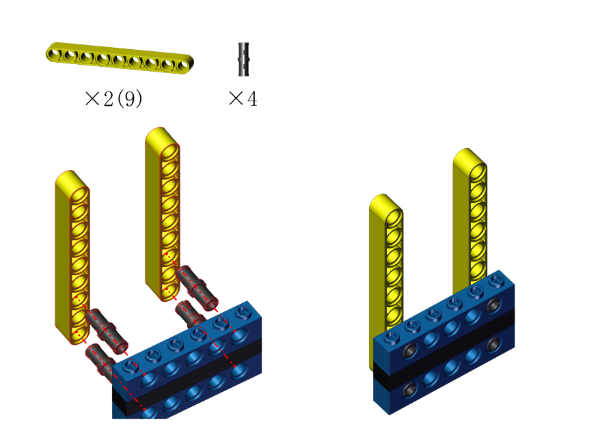


**Step 3**


**Step 4**


**Step 5**


**Step 6**


**Step 7**

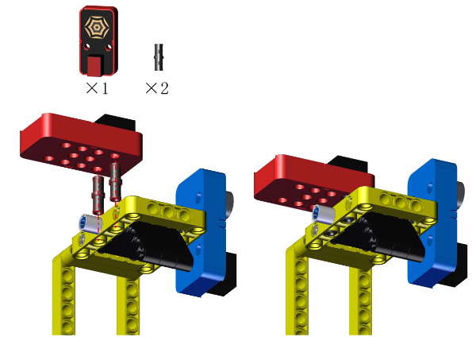


**Step 8**

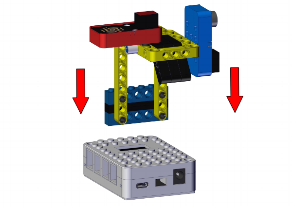


**Completed**


#### Wiring Diagram


#### Test Code

Open **4.1Rain detection.py** and click .

```python
'''
 * Filename    : Rain detection
 * Thonny      : Thonny 4.1.4
 * Auther      : http//www.keyestudio.com
'''
from machine import Pin,PWM,ADC  # Import ADC module
import time

# configure ADC, range of 0-3.3V
# define io26,io27,io28,io29 to ADC channel 0,1,2,3
Water = ADC(28)  #Water = ADC(2)
conversion_fator = 3.3 / 65535  #Voltage value of a single scale

buzzer = PWM(Pin(3))
buzzer.freq(800)

# read the analog value every 0.1s, convert the analog value into voltage output.
while True:
    Water_value = Water.read_u16()
    voltage = Water_value * conversion_fator
    print('ADC Value:',Water_value,'   Voltage:',voltage,'V')
    time.sleep(0.1)
    if voltage > 1:
        buzzer.duty_u16(5000)
    else:
        buzzer.duty_u16(0)
```

#### Code Explanation


**Conceive:**	

Set a threshold of voltage to determine the water volume. When there is too much water, the voltage exceeds the threshold, rain is detected, and the buzzer alarms. The buzzer will stop alarming when the voltage is lower than the threshold.


**Code structure:**

1. Initialization. Set the pins of the steam sensor and the passive buzzer, set the voltage value of a single scale, and set the frequency of the passive buzzer.

2. Loop.

   Print the analog value and voltage of the steam sensor.
   
   Determine whether the voltage exceeds 1 (Herein, we set 1 as the threshold, which is adjustable according to needs).
   
   - voltage > 1: buzzer alarms.
   - voltage ≤ 1: buzzer does not emit sounds.


#### Test Result


After uploading the code, the steam sensor will detects the ambient water volume and converts it to a voltage output. When the voltage is greater than 1, the buzzer alarms. If not, the buzzer will not emit sounds.

<span style="color: rgb(2550, 10, 50);">**ATTENTION: Be careful when using water, please do not to drip to any other place outside the detection area to aviod a short circuit.**</span>


---

### 4.2 Fire Alarm

The fire alarm system of the station can effectively prevent and deal with forest fires.

In this experiment, we build a fire alarm with a flame sensor and a passive buzzer. When flame is detected, the buzzer will emit sounds for alarming. 

#### Flow


#### Assembly


**Required Parts**


**Step 1**


**Step 2**


**Step 3**


**Step 4**


**Step 5**


**Step 6**


**Step 7**


**Step 8**


**Completed**


#### Wiring Diagram


#### Test Code

Open **4.2Fire alarm.py** and click .

```python
'''
 * Filename    : Fire alarm
 * Thonny      : Thonny 4.1.4
 * Auther      : http//www.keyestudio.com
'''
from machine import Pin,PWM,ADC  # Import ADC module
import time

# configure ADC, range of 0-3.3V
# define io26,io27,io28,io29 to ADC channel 0,1,2,3
Flame = ADC(28)  #Photores = ADC(2)
conversion_fator = 3.3 / 65535  #Voltage value of a single scale

buzzer = PWM(Pin(3))
buzzer.freq(800)

# read the analog value every 0.1s, convert the analog value into voltage output.
while True:
    Flame_value = Flame.read_u16()
    voltage = Flame_value * conversion_fator
    print('ADC Value:',Flame_value,'   Voltage:',voltage,'V')
    if voltage < 2:
        buzzer.duty_u16(5000)
    else:
        buzzer.duty_u16(0)
    time.sleep(0.1)
```

#### Code Explanation


**Conceive:**

Set a threshold of voltage to determine whether there is flame. When the sensor detects flame, the voltage is lower than the threshold, and the buzzer alarms. The buzzer will stop alarming when the voltage exceeds the threshold (the sensor detects no flame).


**Code structure:**

1. Initialization. Set the pins of the flame sensor and the passive buzzer, set the voltage value of a single scale, and set the frequency of the passive buzzer.

2. Loop.

   Print the analog value and voltage of the flame sensor.

   Determine whether the voltage is lower than 2 (Herein, we set 2 as the threshold, which is adjustable according to needs).

   - voltage < 2: buzzer alarms.
   - voltage ≥ 1: buzzer does not emit sounds.


#### Test Result


Upload the code. When the flame sensor detects flame, the voltage will lower than 2, and the buzzer will alarm. If not, the buzzer will not emit sounds.

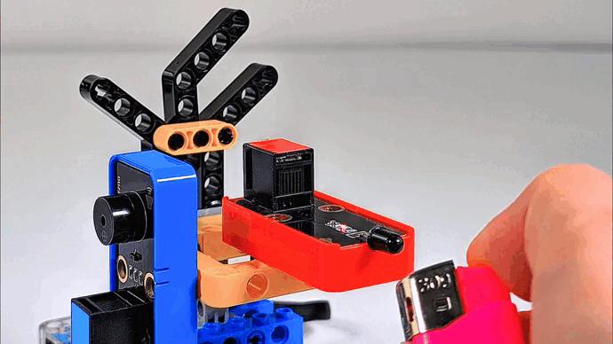


---

### 4.3 Magnetic Field Detection

After the lightning strike, a certain amount of electricity will generated in the surrounding, and a strong magnetic field will be produced in an instant. 

This magnetic field interferes with the connection of the relevant equipment of the station, thus disabling the automatic devices. Therefore, it is necessary to detect the magnetic field at all times and alarm immediately when the magnetic field is detected.

In this experiment, we utilize a Hall sensor and a white LED module to detect magnetic field. When the Hall sensor detects a magnetic field, the white LED lights up.

#### Flow


#### Assembly


**Required Parts**


**Step 1**

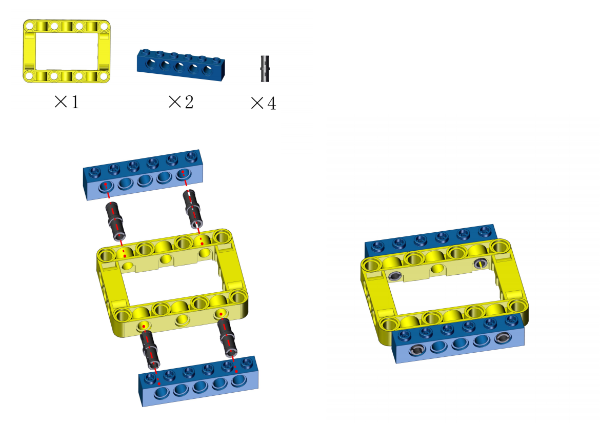


**Step 2**


**Step 3**

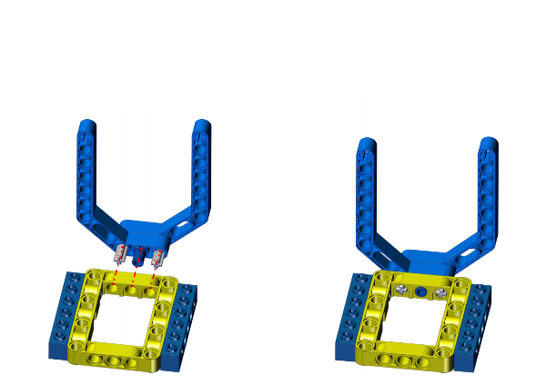


**Step 4**


**Step 5**


**Step 6**


**Step 7**


**Completed**

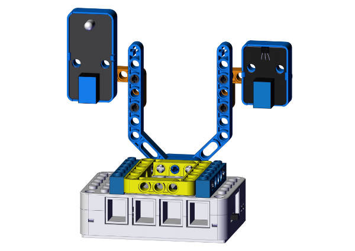


#### Wiring Diagram


#### Test Code

Open **4.3Magnetic field detection.py** and click .

```python
'''
 * Filename    : Magnetic field detection
 * Thonny      : Thonny 4.1.4
 * Auther      : http//www.keyestudio.com
'''
from machine import Pin
import time

hall = Pin(8, Pin.IN)
led = Pin(11, Pin.OUT)
while True:
    value = hall.value()
    print(value, end=' ')
    if value == 0:
        led.on()
        print("A magnetic field")
    else:
        led.off()
        print("There is no magnetic field")
    time.sleep(0.1)
```

#### Code Explanation


**Conceive:**

When the Hall sensor detects a magnetic field, a low power(0) will be output, and the white LED lights up. If there is no magnetic field, high(1) will be output, and the LED goes off.


**Code structure:**

1. Initialization. Set the pins of the Hall sensor and the white LED module.

2. Loop.

   Print the digital value of the power level of the Hall sensor.

   Determine whether the value equals 0 (0 means a magnetic field is detected). 

   - value = 0: the white LED lights up.
   - value ≠ 0: the white LED goes off.


#### Test Result


After uploading the code, the Hall sensor starts to detect magnetic field.

If the sensor detects a magnetic field, the white LED will turn on. If not, the LED will go off.


---

### 4.4 ThDetection

Thunder is the atmospheric sound produced by lightning. When thunder is detected, it sends an alert that rain may be coming.

In this experiment, we integrate a sound sensor and a white LED module to construct a thunder detector. When the thunder volume exceeds a set threshold, the white LED will lights up.

#### Flow


#### Assembly


**Required Parts**


**Step 1**

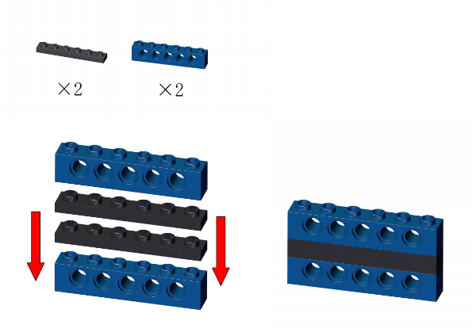


**Step 2**


**Step 3**


**Step 4**


**Step 5**


**Step 6**


**Step 7**


**Completed**


#### Wiring Diagram


#### Test Code

Open **4.4Sound detection.py** and click .

```python
'''
 * Filename    : Sound detection
 * Thonny      : Thonny 4.1.4
 * Auther      : http//www.keyestudio.com
'''
from machine import ADC,Pin
import time

# configure ADC, range of 0-3.3V
# define io26,io27,io28,io29 to ADC channel 0,1,2,3
MicroPhone = machine.ADC(27)  #MicroPhone = ADC(1)

led = Pin(11, Pin.OUT)
while True:
    Micro_value = MicroPhone.read_u16()
    print(Micro_value)
    time.sleep(0.1)
    if Micro_value > 10000:
        led.on()
    else:
        led.off()
```

#### Code Explanation


**Conceive:**

Set a threshold of analog value to determine the thunder volume. When thunder is detected, the analog value exceeds the threshold, and the white LED lights up as an alarm. The LED will go off when the value is lower than the threshold.


**Code structure:**

1. Initialization. Set the pins of the sound sensor and the white LED module.

2. Loop.

   Print the analog value of sound volume detected by the sound sensor.

   Determine whether the analog value is greater than 10000 (<span style="color: rgb(10, 10, 200);">Herein, we set 10000 as the standard threshold of thunder volume, which is adjustable according to needs</span>).

   - analog value > 10000, the white LED lights up.
   - analog value ≤ 10000, the white LED goes off.


#### Test Result


After uploading the code, the sound sensor detects whether there is a thunder. When the analog value of the sound exceeds 10000, a thunder is detected and the white LED will light up.

Here we stimulate thunder by playing music. When the value is greater than 10000, LED lights up.


---

### 4.5 Temperature Detection

It is necessary to monitor the atmospheric temperature in the natural environment in real time. If the temperature is too high, disasters such as fire may occur. When the normal temperature is detected, the green LED lights up; the yellow LED is a reminder for raising temperature; if red LED is on, be very careful because it indicates a high temperature!

In this experiment, the XHT11 temperature and humidity sensor and the traffic light module to measure temperature range. Three colors of LED indicate three ranges of ambient temperature. 

#### Flow


#### Assembly


**Required Parts**


**Step 1**


**Step 2**


**Step 3**


**Step 4**


**Step 5**


**Step 6**


**Completed**


#### Wiring Diagram


#### Test Code

Open **4.5Temperature and humidity detection.py** and click .

```python
'''
 * Filename    : Temperature and humidity detection
 * Thonny      : Thonny 4.1.4
 * Auther      : http//www.keyestudio.com
'''
from machine import Pin
import time
import dht

#Connect XHT11 to pin (2)
XHT = dht.DHT11(Pin(2))

red = Pin(13, Pin.OUT)
yellow = Pin(14, Pin.OUT)
green = Pin(15, Pin.OUT)

# attain temperature and humidity value per second and print them
while True:
    XHT.measure() # enable XHT11 sensor to measure the values once
   # call dht built-in function to attain tempreature value, and print it on Shell
    print('temperature:',XHT.temperature())
    time.sleep(0.1)
    if XHT.temperature() > 35:
        red.on()
        yellow.off()
        green.off()
    elif XHT.temperature() > 29:
        yellow.on()
        red.off()
        green.off()
    elif XHT.temperature() > 24:
        green.on()
        red.off()
        yellow.off() 
```

#### Code Explanation


**Conceive:**

Set three thresholds to separate the temperature range: 24, 29, 35, which are adjustable according to needs.

- preference temperature: 24°C ~ 29°C
- warning temperature: 29°C ~ 35°C
- high temperature: over 35°C

Corresponding LED will light up when the ambient temperature is within the related ranges.

- Within preference temperature range: the green LED lights up
- Within warning temperature range: the yellow LED lights up.
- Within high temperature range: the red LED lights up.


**Code structure:**

1. Initialization. set the pins of XHT11 temperature and humidity sensor and the traffic light module.

2. Loop.

   XHT11 sensor reads and outputs the temperature values.

   Determine which section the temperature value is in, so then light up corresponding LED.

   - 24°C ≤ temperature < 29°C: the green LED lights up and other LEDs are off.
   - 29°C ≤ temperature < 35°C: the yellow LED lights up and other LEDs are off.
   - temperature > 35°C: the red LED lights up and other LEDs are off.


#### Test Result


After uploading the code, the XHT11 sensor detects the ambient temperature value.

When the value is in the preference temperature range, the green LED lights up;

When the value is within the warning temperature range, the yellow LED turns on;

When the value exceeds the high temperature threshold, the red LED lights up.


---

### 4.6 Ultraviolet Detection

In daily life, when the UV index is greater than 3, you'd better do sunscreen measures when going out. This station will calculate the UV index in real time to make timely reminders.

In this experiment, we detect the UV index with an ultraviolet sensor and a traffic light module. When the detected UV index is higher than a set threshold, the red LED will light up.

#### Flow


#### Assembly


**Required Parts**


**Step 1**


**Step 2**


**Step 3**

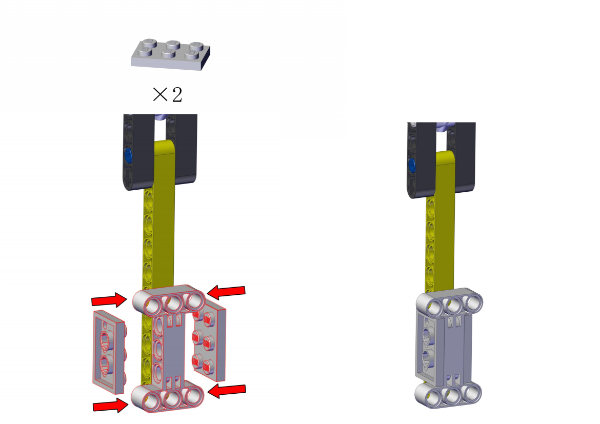


**Step 4**


**Step 5**


**Step 6**


**Step 7**


**Completed**


#### Wiring Diagram


#### Test Code

Open **4.6Ultraviolet detection.py** and click .

```python
'''
 * Filename    : Ultraviolet detection
 * Thonny      : Thonny 4.1.4
 * Auther      : http//www.keyestudio.com
'''
from machine import ADC,Pin
import time

# configure ADC, range of 0-3.3V
# define io26,io27,io28,io29 to ADC channel 0,1,2,3
ultraviolet = ADC(26)  #ultraviolet = ADC(0)
conversion_fator = 3.3 / 65535  #Voltage value of a single scale

red = Pin(13, Pin.OUT)

while True:
    ultraviolet_value = ultraviolet.read_u16()
    voltage = int(ultraviolet_value * conversion_fator * 1000)  #convert unit into mV
    print(voltage,'mV',end = '     ')
    # voltage < 50
    if voltage < 50:
        uv = 0
    # 50 < voltage < 227
    elif voltage < 227:
        uv = 1
    # 227 < voltage < 318
    elif voltage < 318:
        uv = 2
    # 318 < voltage < 408
    elif voltage < 408:
        uv = 3
    # 408 < voltage < 503
    elif voltage < 503:
        uv = 4
    # 503 < voltage < 606
    elif voltage < 606:
        uv = 5
    # 606 < voltage < 696
    elif voltage < 696:
        uv = 6
    # 696 < voltage < 795
    elif voltage < 795:
        uv = 7
    # 795 < voltage < 881
    elif voltage < 881:
        uv = 8
    # 881 < voltage < 976
    elif voltage < 976:
        uv = 9
    # 976 < voltage < 1079
    elif voltage < 1079:
        uv = 10
    # 1079 < voltage
    else:
        uv = 11
    time.sleep(0.1)
    print('uv Index = ',uv)
    if uv > 3:
        red.on()
    else:
        red.off()
```

#### Code Explanation


**Conceive:**

When the UV index is within 0 ~ 2, the ultraviolet light is the weakest, and it does not have much effect on the human body. When the index increases to 3 ~ 4, the ultraviolet light is weak, but remember to wear sunscreen when going out. 

Herein, we set the threshold of the UV index to 3. If the value exceeds 3, the red LED will light up to remind you to wear sunscreen. If the value does not reach 3, the LED will go off.


**Code structure:**

1. Initialization. Set the pins of the ultraviolet sensor and the traffic light module.

2. Loop.

   if elif statement to determine the range of UV index, and output the value.

   Determine whether the UV index exceeds 3.

   - UV index > 3: the red LED lights up as a reminder.
   - UV index ≤ 3: the red LED goes off.


#### Test Result


After uploading the code, when the UV index is greater than 3, the red LED will light up to remind you to take sun protection measures when going out.


---
### 4.7 Air Pressure Detection

The station monitors air pressure in real time. When the air pressure is in normal range, the green LED lights up; When it is in the low range, the yellow LED turns on; When it is high, the red LED is on.

In this experiment, we use an LPS331APTR air pressure sensor and a traffic light module to reveal the air pressure. LED will light up in corresponding colors when the pressure value is in the related set range.

#### Flow


#### Assembly


**Required Parts**


**Step 1**


**Step 2**


**Step 3**


**Step 4**


**Step 5**


**Step 6**


**Step 7**


**Step 8**

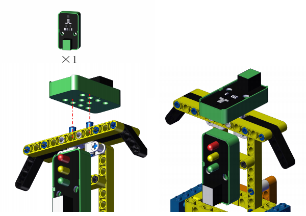


**Step 9**


**Completed**


#### Wiring Diagram


#### Test Code

Open **4.7Air pressure detection.py** and click .

```python
'''
 * Filename    : Air pressure detection
 * Thonny      : Thonny 4.1.4
 * Auther      : http//www.keyestudio.com
'''
from machine import Pin
import time
from LPS331AP import lps331ap

scl = Pin(5) 
sda = Pin(4)
bus = 0
pressure_temp = lps331ap(bus, scl, sda)

red = Pin(13, Pin.OUT)
yellow = Pin(14, Pin.OUT)
green = Pin(15, Pin.OUT)
while True:
    pressure_temp.measure()
    print('pressure:',pressure_temp.pressure_data)
    time.sleep(0.1)
    if pressure_temp.pressure_data > 1050:
        red.on()
        yellow.off()
        green.off()
    elif pressure_temp.pressure_data < 950:
        yellow.on()
        red.off()
        green.off()
    elif:
        green.on()
        red.off()
        yellow.off()
```

#### Code Explanation


**Conceive:**

Generally, air pressure within 950hPa ~ 1050hPa is regared as the normal range. If the pressure is lower than 950hPa or higher than 1050hPa, human may have a headache or dizziness, and even some meteorological disasters will happen.

Set 950 and 1050 as two thresholds to divide the pressure into three ranges.

- low pressure: lower than 950hPa
- normal pressure: 950hPa ~ 1050hPa 
- high pressure: higher than 1050hPa

LED will light up in corresponding colors when the pressure value is in the related set range.

- Within low pressure range: the yellow LED lights up.
- Within normal pressure range: the green LED lights up.
- Within high pressure range: the red LED lights up.


**Code structure:**

1. Initialization. set the pins of LPS331APTR air pressure sensor and the traffic light module.

2. Loop.

   LPS331APTR sensor reads the air pressure value and outputs it.

   Determine which range of the pressure value is in, in order to turn of related LED.

   - air pressure > 1050hPa: the red LED lights up and other two LEDs goes off.
   - air pressure < 950hPa: the yellow LED lights up and other two LEDs goes off.
   - 950hPa < air pressure < 1050hPa: the green LED lights up and other two LEDs goes off.


#### Test Result


After uploading the code, the LPS331APTR sensor measures the air pressure.

When the air pressure is in normal range, the green LED lights up;

When the air pressure is in the low range, the yellow LED lights up;

When the air pressure is in the high range, the res LED turns on.


---
