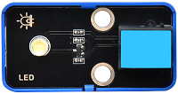

# Mini Meteorological Station Kit

## Description

Based on KidsBlock and python programming language, the Mini Meteorological Station Kit is designed for children aged 9-12 years old, which can be adapted to Legos and three types of mainboards: kidsUNO, kidsIOT and kidspico.

KidsBlock integrates building blocks to program by combining code blocks, so you do not have to learn complex programming syntax. You may learn programming much easier!

Python programming language is with simplicity and concise syntax, so it is easy to learn and suitable for beginners. You may master a systematic programming knowledge step by step!

In this kit, multiple sensors and modules are included: white LED module, Hall sensor, passive buzzer, XH11 temperature and humidity sensor, steam sensor, flame sensor, sound sensor ultraviolet sensor, traffic light module and air pressure sensor. Besides, we design seven comprehensive experiments for the kit with building blocks: rain detection, fire alarm, magnetic field detection, thunder detection, temperature detection, ultraviolet detection and air pressure detection. These building blocks are provided, so you may design forms at will, which greatly improves logical analysis, creativity, hands-on skills and problem-solving ability.

---

## Kit List

**The main boards are not included in this kit!**

|  #   |                 NAME                  |               PIC               | QTY  |
| :--: | :-----------------------------------: | :-----------------------------: | :--: |
| 1   |        White LED module         |      |  1 |
| 2   |             Hall sensor             |      |  1 |
| 3   |           Passive buzzer            |      |  1 |
| 4   | XHT11 temperature and humidity sensor |      |  1 |
| 5   |           Steam sensor            |      |  1 |
| 6   |           Flame sensor            |      |  1 |
| 7   |            Sound sensor             |  |  1 |
| 8   |        Ultraviolet sensor         |      |  1 |
| 9   |        Traffic light module         |      |  1 |
|  10  |    LPS331APTR air pressure sensor     |      |  1   |
| 11  |           Telephone Cable           |          |  5 |
| 12  |           Building Block            |         |  12 |
|  13  |            Building Block             |         |  2   |
|  14  |            Building Block             |         |  9   |
|  15  |            Building Block             |         |  2   |
|  16  |            Building Block             |         |  2   |
|  17  |            Building Block             |         |  2   |
|  18  |            Building Block             |         |  2   |
|  19  |            Building Block             |         |  2   |
|  20  |            Building Block             |         |  2   |
|  21  |            Building Block             |         |  2   |
|  22  |            Building Block             |         |  1   |
|  23  |            Building Block             |         |  1   |
|  24  |            Building Block             |         |  2   |
|  25  |            Building Block             |         |  2   |
|  26  |            Building Block             |         |  3   |
|  27  |            Building Block             |         |  1   |
|  28  |            Building Block             |         |  1   |
|  29  |            Building Block             |         |  1   |
|  30  |            Building Block             |         |  2   |
|  31  |            Building Block             |         |  2   |
|  32  |            Building Block             |         |  1   |
|  33  |            Building Block             |         |  1   |
|  34  |            Building Block             |         |  1   |
|  35  |            Building Block             |         |  1   |
|  36  |            Building Block             |         |  2   |
| 37 | Phillips screwdriver |  | 1 |

---

## Main Boards

**The main boards are not included in this kit!**

**Before experiments, please have a good grasp of main boards:**

[kidsuno](https://wiki.kidsbits.cc/projects/KD2075/en/latest/)

[kidsIOT](https://wiki.kidsbits.cc/projects/KD2076/en/latest/)

[kidspico]( https://wiki.kidsbits.cc/projects/KD2077/en/latest/)

**On-board OLED Display Tutorials:**

[kidsuno_OLED](https://wiki.kidsbits.cc/projects/KD2075/en/latest/docs/kidsUno.html#oled-display)

[kidsIOT_OLED](https://wiki.kidsbits.cc/projects/KD2076/en/latest/docs/kidsIOT.html#id1)

[kidspico_OLED]( https://wiki.kidsbits.cc/projects/KD2077/en/latest/docs/KidsPico.html#id2)
